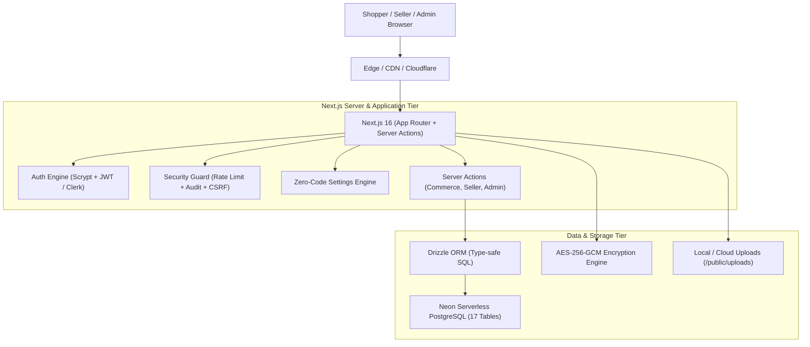

# 🏛️ AALM VASTRALAY — ARCHITECTURE DESIGN DOCUMENT
# Location: .ai/ARCHITECTURE.md

## 1. High-Level System Architecture

## 2. Component Layers & Responsibility

### Layer 1: Presentation & UI (`src/components/` & `src/app/`)
- **Server Components:** Fetch data directly via Drizzle queries with zero client bundle footprint.
- **Client Components (`"use client"`):** Used only for interactive states (drawers, carousels, forms, live filtering, Turnstile `<ClickToSolve />`).
- **Styling:** Tailwind CSS with CSS Variables (`var(--brand)`, `var(--accent)`, `var(--surface)`) supporting live admin customization and dark mode.

### Layer 2: Business Logic & Server Actions (`src/actions/`)
- Pure server-side validation using **Zod**.
- Transactional state updates with audit logging (`recordAudit`).
- Targeted cache invalidation (`updateTag`) for instant UI synchronization without layout nukes.

### Layer 3: Security & Privacy (`src/lib/security/`, `src/lib/pow.ts`, `src/lib/encryption.ts`)
- Cryptographic hashing of user passwords with Scrypt.
- Authenticated AES-256-GCM cipher for database credential protection.
- In-memory and database rate-limiting with IP anti-spoof validation and fail-closed defense.
- Self-hosted Turnstile-style click-to-solve PoW defense with `/24` subnet drift binding and single-use anti-replay `pow_used` table.
- Tenant isolation ensuring sellers only access their own store data.

### Layer 4: Persistence & Database (`src/db/`)
- Drizzle ORM schemas (`src/db/schema.ts`) defining 17 strongly-typed tables.
- Zero-touch bootstrap (`src/db/init.ts`) ensuring automatic table and index creation on startup.
- Safe database reset mechanisms preserving core catalog and settings.

## 3. Route Topology & Rendering Strategy

| Route Category | Path | Rendering Strategy | Revalidation | Access Control |
| :--- | :--- | :--- | :--- | :--- |
| **Catalog** | `/`, `/products`, `/categories` | Static / ISR | 120s / 300s | Public |
| **Entity Detail**| `/products/[slug]`, `/categories/[slug]`, `/stores/[slug]` | ISR | 60s / 300s | Public |
| **Content & Blog**| `/blog`, `/blog/[slug]`, `/handbook` | SSG / Static ISR | 3600s | Public |
| **Support Hub** | `/help`, `/faq`, `/shipping`, `/size-guide` | Static ISR | 86400s | Public |
| **Legal** | `/privacy`, `/terms`, `/cookies`, `/contact`, `/returns`, `/refund-policy`, `/shipping-policy` | Static | `force-static` | Public |
| **Interactive** | `/cart`, `/checkout`, `/search`, `/track-order`, `/dashboard`, `/wishlist` | Dynamic | Request time | User / Session |
| **Seller Hub** | `/seller`, `/seller/products/*`, `/seller/orders`, `/seller/settings` | Dynamic | Request time | Role = `seller` / `admin` |
| **Admin Console**| `/admin`, `/admin/users`, `/admin/sellers`, `/admin/products`, `/admin/orders`, `/admin/categories`, `/admin/coupons`, `/admin/banners`, `/admin/theme`, `/admin/settings`, `/admin/audit-logs` | Dynamic / Actions | Server Action | Role = `admin` |
| **Public APIs** | `/api/categories`, `/api/search`, `/api/products` | Edge Cached JSON | 60s - 300s | Public |
| **Admin APIs** | `/api/admin/users`, `/api/admin/sellers`, `/api/admin/products`, `/api/admin/orders`, `/api/admin/coupons`, `/api/admin/banners`, `/api/admin/settings` | Protected JSON | Request time | Role = `admin` |
| **System & SEO** | `/sitemap.xml`, `/manifest.webmanifest`, `/robots.txt`, `/icon`, `/apple-icon` | Static / ISR | 3600s - 86400s | Public |

