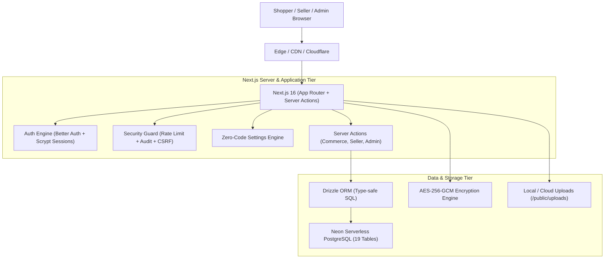
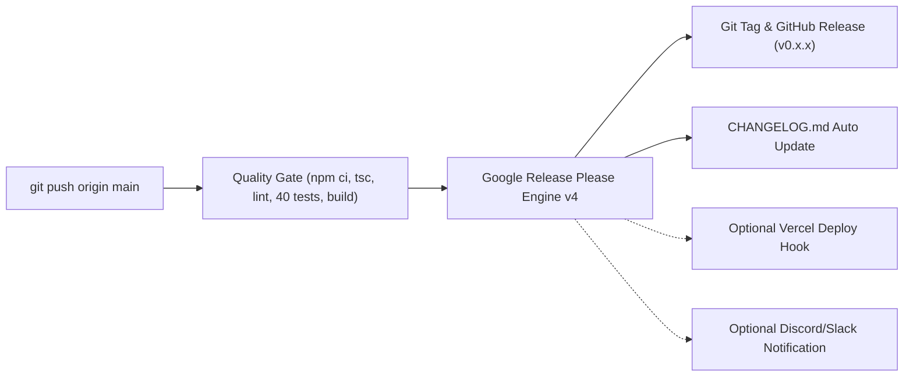

# 🏛️ AALM VASTRALAY — ARCHITECTURE DESIGN DOCUMENT
# Location: .ai/ARCHITECTURE.md

## 1. High-Level System Architecture

```mermaid
flowchart TD
    Client["Shopper / Seller / Admin Browser"] --> Cloudflare["Edge / CDN / Cloudflare"]
    Cloudflare --> NextApp["Next.js 16 (App Router + Server Actions)"]
    
    subgraph Server_Tier["Next.js Server & Application Tier"]
        NextApp --> AuthEngine["Auth Engine (Better Auth + Scrypt Sessions)"]
        NextApp --> SecurityGuard["Security Guard (Rate Limit + Audit + CSRF)"]
        NextApp --> SettingsEngine["Zero-Code Settings Engine"]
        NextApp --> ActionsEngine["Server Actions (Commerce, Seller, Admin)"]
    end
    
    subgraph Data_Tier["Data & Storage Tier"]
        ActionsEngine --> DrizzleORM["Drizzle ORM (Type-safe SQL)"]
        DrizzleORM --> NeonPostgres["Neon Serverless PostgreSQL (19 Tables)"]
        NextApp --> EncryptionEngine["AES-256-GCM Encryption Engine"]
        NextApp --> LocalStorage["Local / Cloud Uploads (/public/uploads)"]
    end
```

## 2. Component Layers & Responsibility

### Layer 1: Presentation & UI (`src/components/` & `src/app/`)
- **Server Components:** Fetch data directly via Drizzle queries with zero client bundle footprint.
- **Client Components (`"use client"`):** Used only for interactive states (drawers, carousels, forms, live filtering, Turnstile `<ClickToSolve />`). Functions are never passed across the RSC serialization boundary.
- **Route Error Boundaries:** `src/app/error.tsx` (Global) and `src/app/products/[slug]/error.tsx` (Product Detail) preserve Header, Footer, and Navigation context with in-place retry capabilities.
- **Styling:** Tailwind CSS with CSS Variables (`var(--brand)`, `var(--accent)`, `var(--surface)`) supporting live admin customization and dark mode.

### Layer 2: Business Logic & Server Actions (`src/actions/`)
- Pure server-side validation using **Zod**.
- Transactional state updates with audit logging (`recordAudit`).
- Targeted cache invalidation (`updateTag`) for instant UI synchronization without layout nukes.

### Layer 3: Security & Privacy (`src/lib/required-env.ts`, `src/lib/security/`, `src/lib/pow.ts`, `src/lib/encryption.ts`)
- Centralized fail-closed environment secret gateway (`getRequiredEnv()`) eliminating hardcoded fallback strings.
- Cryptographic hashing of user passwords with Scrypt.
- Authenticated AES-256-GCM cipher for database credential protection.
- In-memory and database rate-limiting with IP anti-spoof validation and fail-closed defense.
- Self-hosted Turnstile-style click-to-solve PoW defense with `/24` subnet drift binding and single-use anti-replay `pow_used` table.
- Tenant isolation ensuring sellers only access their own store data.

### Layer 4: Persistence, Storage & Analytics (`src/db/`, `src/lib/b2.ts`, `@duckdb/duckdb-wasm`)
- Drizzle ORM schemas (`src/db/schema.ts`) defining 19 strongly-typed tables.
- Zero-touch bootstrap (`src/db/init.ts`) ensuring automatic statement-level isolated table and index creation on startup.
- Neon PostgreSQL `media_assets` table caching B2 metadata (eliminates Class C billing).
- Database-backed `review_votes` table and `helpful_count` column conforming to BIS IS 19000:2022.
- Client-side DuckDB-Wasm in-process OLAP engine for zero-cost GST 5%/12% and GMV calculations.
- Safe database reset mechanisms preserving core catalog and settings.

### Layer 5: AI Intelligence & Universal Media Pipeline (`src/lib/ai/`, `src/lib/image-resolver.ts`, `src/components/media/SmartImage.tsx`)
- **Multi-Tier Vision AI:** Google Gemini primary with Pollinations Vision keyless tier-2 backup for 1-click product attribute extraction.
- **AI Variant Studio:** Prompt-guided Flux/SDXL image synthesis for 8 Indian couture colorways with live Base64 data URI preview and 1-click B2 storage.
- **Resilient Media Hierarchy:** 3-tier browser fallback chain (`Cloudflare Worker Proxy -> wsrv.nl WebP Cache -> Backblaze B2 Direct -> Placeholder`) guaranteeing 0 broken image icons across all network environments.

## 3. Route Topology & Rendering Strategy

| Route Category | Path | Rendering Strategy | Revalidation | Access Control |
| :--- | :--- | :--- | :--- | :--- |
| **Catalog** | `/`, `/products`, `/categories` | Static / ISR | 120s / 300s | Public |
| **Entity Detail**| `/products/[slug]`, `/categories/[slug]`, `/stores/[slug]` | ISR | 60s / 300s | Public |
| **Content & Blog**| `/blog`, `/blog/[slug]`, `/handbook` | SSG / Static ISR | 3600s | Public |
| **Support Hub** | `/help`, `/faq`, `/shipping`, `/size-guide` | Static ISR | 86400s | Public |
| **Legal** | `/privacy`, `/terms`, `/cookies`, `/contact`, `/returns`, `/refund-policy`, `/shipping-policy` | Static | `force-static` | Public |
| **Interactive** | `/cart`, `/checkout`, `/search`, `/track-order`, `/dashboard`, `/wishlist` | Dynamic | Request time | User / Session |
| **Seller Hub** | `/seller`, `/seller/products/*`, `/seller/orders`, `/seller/settings`, `/seller/analytics` | Dynamic | Request time | Role = `seller` / `admin` |
| **Admin Console**| `/admin`, `/admin/users`, `/admin/sellers`, `/admin/products`, `/admin/orders`, `/admin/categories`, `/admin/coupons`, `/admin/banners`, `/admin/theme`, `/admin/settings`, `/admin/analytics`, `/admin/audit-logs` | Dynamic / Actions | Server Action | Role = `admin` |
| **Public APIs** | `/api/categories`, `/api/search`, `/api/products`, `/api/avatar` | Edge Cached JSON | 60s - 300s | Public |
| **Admin APIs** | `/api/admin/users`, `/api/admin/sellers`, `/api/admin/products`, `/api/admin/orders`, `/api/admin/coupons`, `/api/admin/banners`, `/api/admin/settings`, `/api/admin/analytics/dataset` | Protected JSON | Request time | Role = `admin` |
| **System & SEO** | `/sitemap.xml`, `/manifest.webmanifest`, `/robots.txt`, `/icon`, `/apple-icon` | Static / ISR | 3600s - 86400s | Public |

## 4. Automated Release & Quality Pipeline

```mermaid
flowchart LR
    Push["git push origin main"] --> QG["Quality Gate (npm ci, tsc, lint, 40 tests, build)"]
    QG --> RP["Google Release Please Engine v4"]
    RP --> Tag["Git Tag & GitHub Release (v0.x.x)"]
    RP --> ChangeLog["CHANGELOG.md Auto Update"]
    RP -.-> Deploy["Optional Vercel Deploy Hook"]
    RP -.-> Notify["Optional Discord/Slack Notification"]
```

## 5. Interactive System Architecture (Archify 3.0)

For an interactive, zoomable, deep-dive architectural visualization of the entire system, refer to:
- **Architecture Showcase Artifact:** `.archify/architecture-aalm-vastralay-20261006-134300/architecture.html`
- Contains interactive SVG graph representations of frontend layers, server actions, database tables, and external security gateways.

