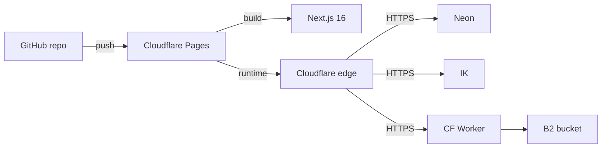
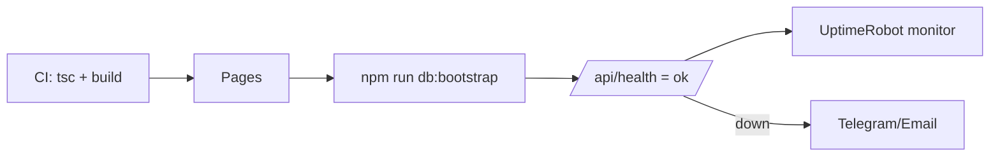

# Aalm Vastralay — Wedding & Ethnic Wear Marketplace

A production-grade, multi-vendor e-commerce platform built with **Next.js 16 (App Router) + PostgreSQL (Drizzle ORM)**, designed to run on **permanent free tiers with no credit card** and serve 1,000+ daily customers. Everything below is editable from `/admin` – no code changes needed.

> **Live:** https://aalm-vastralay.pages.dev · **Operator console:** `/admin`
> **Security Audit:** Audited & Hardened (Connection pooling, CSRF, PoW anti-bot, Open-redirect protection).

## 🚀 Quick start

```bash
npm ci
cp .env.example .env             # set DATABASE_URL (Neon or local Postgres)
npm run db:bootstrap             # creates any missing tables + back-fills settings (idempotent)
npm run dev                      # http://localhost:3000
```

Demo data is seeded automatically on first boot. To reseed:

```bash
npx tsx src/db/seed.ts           # skip if data exists
npx tsx src/db/seed.ts --reset   # wipe + reseed
```

### Production Roles & Access Control

| Role | How it is created | Access & Dashboard |
| --- | --- | --- |
| **Super Admin** | Auto-created on first deployment (`admin@aalmvastralay.com`) or via `ADMIN_EMAIL` | `/admin` — Full marketplace control (settings, commission, stores, security) |
| **Seller (Vendor)** | Registered customers click **Become a Seller** or visit `/onboarding` | `/seller` — Manage products, stock, variants, and incoming orders |
| **Customer (Shopper)** | Public registration at `/sign-up` | `/dashboard`, `/cart`, `/orders` — Browse, purchase, and review |

## 🧩 What you can customise without code

Open **/admin → Site settings** (sign in as admin):

| Group | Examples |
| --- | --- |
| Brand | Name, tagline, logo, favicon emoji, scrolling announcements + speed, phone, WhatsApp, email, address, socials |
| Theme | Default colour mode, show/hide the visitor dark-mode switch, primary + accent colours (light & dark), background/surface colours, corner radius, display font, layout density |
| Homepage | Hero banner image, height, overlay, badge, headline, both CTAs, **grid columns per device**, enable/reorder/resize every homepage section, occasion chips, category-card artwork |
| Commerce | Currency symbol + display conversion, rounding, free-shipping threshold, standard + COD fees, return window, GST rate/inclusive flag, minimum order value, shipping weight unit, catalogue page size & default sort |
| Seller | Commission-free months, post-launch commission %, auto-approve listings, GST requirement, max images per product, open/close registration |
| Security | Bot protection mode, **proof-of-work weight**, iteration budget, form/sign-in/API rate limits, lockout threshold + duration, session lifetime, strong-password policy, proxy header trust |
| Features | Wishlist, reviews, coupons, COD, online payment, notifications, stores directory, occasions, seller hub, analytics – each a switch |

All money arithmetic (orders, discounts, GST, payouts) is executed **server-side in INR** and re-computed on every action; display currency/rounding only changes presentation, so totals can never be spoofed or drift.

## 🛡️ Security model

| Threat | Mitigation |
| --- | --- |
| Form spam / scripted sign-ups | Signed expiring proof-of-work challenge (`/api/security/challenge`), PBKDF2, verified server-side; difficulty = “weight” (leading zeros), admin-tunable |
| Brute-force login | Per-IP throttle (10 attempts / 10 min) + per-account lockout after N failures for M minutes; generic error messages prevent account enumeration |
| Session theft / replay | HttpOnly + SameSite cookie; HMAC-signed payload `userId.expiry.signature`; signature salt = hash of the user’s password hash → password change invalidates every session |
| CSRF | Server Actions + POST-only transport; cookies are SameSite=Lax; every mutation re-checks ownership server-side |
| Injection | 100% parameterised queries via Drizzle ORM; zod validation on every form and API body |
| XSS | React escaping + strict CSP, `frame-ancestors 'none'`, no `dangerouslySetInnerHTML` on user input |
| Clickjacking | `X-Frame-Options: DENY` + `frame-ancestors 'none'` |
| Data exfiltration / sniffing | `nosniff`, strict referrer policy, tight `connect-src`/`img-src` allow-lists, Permissions-Policy lockdown |
| Price tampering | Cart/order totals recomputed from the database (price + variant adjustment + shipping + coupon), never trusted from the client |
| DoS / scraping | DB-backed fixed-window rate limits at three layers (edge middleware, server actions, API routes) + `LIMIT`-bounded queries + indexes |
| Privilege escalation | `requireUser` / `requireRole` guards in every layout + action; sellers can only touch their own store’s rows |
| Silent tampering | Append-only `audit_logs` (actor, IP, UA, before/after detail) for orders, products, stores, roles, coupons, settings, auth events |

## 📱 Responsive UX

| Surface | Features |
| --- | --- |
| Header | Marquee announcement, logo + monogram fallback, sticky search with live suggestions (debounced), quick-access icons (notifications, wishlist, bag), profile menu |
| Mobile | Bottom tab bar, slide-in category drawer with expandable parent → child, safe-area padding, large tap targets, 1–6 column configurable grids |
| Tablet / Desktop | 3–4 column grids, dense filters, hover reveals, scroll-reveal sections, toasts, shimmer skeletons |
| Display drawer | Per-visitor theme switch, text size 90–125 %, layout density, motion toggle – saved on device |
| Print | Invoice stylesheet hides chrome |

## 🧱 Project structure

```
src/
  app/                         # routes (App Router, all server-rendered on demand)
    (legal)/                   # /privacy /terms /returns /cookies /contact /about
    admin/                     # admin console (settings, security, integrations)
    api/                       # /health /products /search/suggest /security/challenge /newsletter /uploads/[bucket] /webhooks/clerk
    og/                        # Open Graph image generator (edge runtime)
    products/ stores/ cart/ checkout/ orders/ wishlist/ dashboard/ notifications/
    seller/                    # seller hub (layout guards store ownership)
    robots.ts sitemap.ts
  actions/                     # server actions: auth, cart, orders, seller, admin
  components/
    account/                   # PhotoUploader, ProfileForm
    admin/                     # SettingsEditor, AdminForms
    auth/                      # AuthForm
    cart/ checkout/ header/ product/ seller/ security/ theme/ ui/
  db/
    schema.ts                  # Section 3 of the blueprint (UUID PKs, TIMESTAMPTZ, checks, GIN FTS)
    seed.ts                    # demo data
    index.ts
  lib/
    auth.ts                    # session auth (Clerk-ready swap)
    format.ts                  # money formatting + transliteration (altcha-style bilingual)
    pow.ts                     # proof-of-work verifier
    rate-limit.ts              # DB-backed fixed-window limiter
    audit.ts                   # append-only audit log
    settings.ts                # server-side settings reader
    settings-defs.ts           # client-safe field definitions + defaults
    settings-snapshot.ts       # client-safe snapshot for display
    backbone.ts                # free-tier service catalogue shown in admin
    request.ts                 # IP + UA helpers
    media-resolver.ts          # b2: / ik: / https: / local → URL
    uploads.ts                 # local /uploads persistence (5 MB cap, mime allow-list)
    email.ts                   # quiet-mail hook
  instrumentation.ts           # self-heal settings + seed at boot
  proxy.ts                     # security headers + route protection + API throttle
  app/globals.css              # theme tokens, dark mode, animations
workers/b2-proxy/worker.js     # Cloudflare Worker for private B2 bucket
scripts/db-bootstrap.ts        # npm run db:bootstrap — production deploy
public/images/                # bundled assets (swap by uploading via admin when S3/B2 is configured)
public/uploads/                # local fallback for avatar / store images
docs/                          # architecture + runbook (with mermaid diagrams)
```

## ☁️ Free-tier deployment (Cloudflare Pages)



1. **Neon** – create project in `ap-south-1`, copy pooled connection string into `DATABASE_URL`.
2. **ImageKit** – create URL endpoint, copy URL + keys.
3. **Backblaze B2** – create private bucket + application key, deploy the Worker (`workers/b2-proxy`), set the secret envs.
4. **Cloudflare Pages** – connect GitHub repo, set build command `npm run build`, output `.next/`, add every env var from `.env.example`.
5. `npm run db:bootstrap` locally or in CI to ensure tables and settings are in place.

## ✅ Production verification checklist



## 📚 More docs

- [Architecture diagrams](docs/architecture.md)
- [Operator runbook](docs/runbook.md)
- [Legal pages](src/app/(legal))

## ✅ Checklist

- [x] Next.js 16 project, Tailwind 4, Drizzle, PostgreSQL schema with indexes + FTS
- [x] Auth (sessions now, Clerk-ready swap), products, cart, wishlist, coupons, orders, returns, reviews, notifications
- [x] Seller hub with photo/logo/banner upload and product CRUD
- [x] Admin console (overview, settings, security, integrations)
- [x] Self-hosted proof-of-work bot shield (no captcha vendor)
- [x] Rate limits at edge + actions + API, brute-force lockout
- [x] Sitemap.xml, robots.txt, OG image generator, legal pages
- [x] Avatar + store logo/banner upload (local; swap to B2/ImageKit by URL)
- [x] `npm run db:bootstrap` for idempotent deploys
- [ ] Create Neon project & paste `DATABASE_URL`
- [ ] Create ImageKit / B2 / Cloudflare accounts and fill `.env.local`
- [ ] Deploy Worker, deploy to Cloudflare Pages
- [ ] Add UptimeRobot monitor for `/api/health`, Loglyuk script, errex DSN
- [ ] Load test (e.g. `npx autocannon -c 50 -d 60 https://<site>/products`) to confirm free-tier headroom
