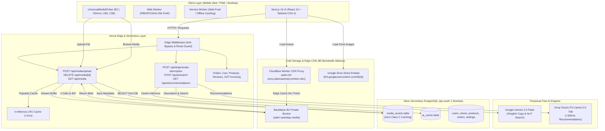

<div align="center">

# 👑 AALM VASTRALAY (आलम वस्त्रालय)
### *Next-Generation Indian Ethnic Wear & Bridal Multi-Vendor Marketplace*
#### *Enterprise Open-Source Turnkey E-Commerce Engine • 100% Perpetual $0/Month Infrastructure*

<br/>

[-000000?style=for-the-badge&logo=nextdotjs&logoColor=white)](https://nextjs.org/)
[](https://react.dev/)
[](https://www.typescriptlang.org/)
[](https://tailwindcss.com/)
[](https://neon.tech/)
[](https://orm.drizzle.team/)
[](docs/TECH_STACK_AND_ARCHITECTURE.md)
[](tests/)
[](https://workers.cloudflare.com/)
[](https://www.backblaze.com/b2/)
[](https://aistudio.google.com/)
[](https://groq.com/)
[-gold?style=for-the-badge&logo=googlecloud&logoColor=black)](docs/TECH_STACK_AND_ARCHITECTURE.md)

<br/>

**[🌐 Live Storefront](https://aalm-vastralay.vercel.app)** &nbsp;•&nbsp; 
**[⚡ Admin Console](https://aalm-vastralay.vercel.app/admin)** &nbsp;•&nbsp; 
**[🏪 Seller Hub](https://aalm-vastralay.vercel.app/seller)** &nbsp;•&nbsp; 
**[📖 Tech Stack & Architecture](docs/TECH_STACK_AND_ARCHITECTURE.md)** &nbsp;•&nbsp; 
**[🚀 3-Minute Setup Runbook](docs/SETUP.md)**

<br/>

| ⚡ Production Readiness | 💰 Operating Cost | 🛡️ Security Architecture | 🧊 Cold Storage | 🦆 In-Memory OLAP | 🧪 Automated Tests |
| :---: | :---: | :---: | :---: | :---: | :---: |
| **Enterprise Ready** | **$0.00 / month** | **Self-Hosted PoW Bot Shield** | **0 Class C Transactions** | **DuckDB-Wasm Vector Engine** | **36/36 Test Suites (100%)** |

<br/>

> **Aalm Vastralay** is an enterprise-grade, high-performance Indian ethnic wear marketplace and **Turnkey Open-Source Multi-Vendor E-Commerce Template**. Engineered with **Next.js 16 App Router**, **React 19**, and **Neon Serverless PostgreSQL**, the entire architecture operates perpetually on **$0/month free tiers** with zero third-party captchas, zero fake reviews, zero recurring SaaS costs, and zero data loss. Features native Backblaze B2 cold media storage with Cloudflare CDN proxy, zero-cost Google Gemini + Groq AI engines, and interactive 1-click cloud setup.

</div>

---

## ⚡ Executive Feature Matrix

```
┌────────────────────────────────────────────────────────────────────────────────────────┐
│                                    PLATFORM PILLARS                                    │
├──────────────────────────────┬──────────────────────────────┬──────────────────────────┤
│  💰 100% Perpetual $0/mo Cost│  🛡️ Self-Hosted Bot Shield   │  🧊 Zero Class C Storage │
│  • Neon Serverless (0.5GB)   │  • Web Worker PBKDF2/SHA-256 │  • Cloudflare Worker CDN │
│  • Vercel Hobby Serverless   │  • 10 Luxury Archetypes      │  • DB Metadata Caching   │
│  • Google Gemini 2.5 Flash   │  • /24 Cellular Roaming Safe │  • Hard Permanent Purge  │
│  • Groq Cloud LPU Inference  │  • Single-Use pow_used Store │  • Bandwidth Alliance ₹0 │
├──────────────────────────────┼──────────────────────────────┼──────────────────────────┤
│  🇮🇳 Indian Commerce Engine   │  👥 Multi-Vendor Isolation   │  🛠️ 105+ Live Settings   │
│  • 0% Fee Dynamic UPI QR     │  • Strict Store Boundary     │  • Zero-Code Live Studio │
│  • 12-Digit UTR Verification │  • Vendor Order Management   │  • Hero Carousel Manager │
│  • GST Statutory Invoicing   │  • Variant Stock (XS to XXL) │  • Real-Time Swatches    │
│  • Shiprocket & Delhivery    │  • Multi-Account Google Drive│  • Marketing Broadcasts  │
└──────────────────────────────┴──────────────────────────────┴──────────────────────────┘
```

---

## 📑 Table of Contents

1. [✨ Key Architectural Innovations](#-key-architectural-innovations)
2. [🏛️ System Architecture Topology](#️-system-architecture-topology)
3. [🧊 Cold Storage & Zero Class C Optimization](#-cold-storage--zero-class-c-optimization)
4. [🧠 100% Free Cultural AI Engines](#-100-free-cultural-ai-engines)
5. [👥 Marketplace Personas & Universal CRUD](#-marketplace-personas--universal-crud)
6. [🛠️ 105+ Zero-Code Live Admin Studio](#️-105-zero-code-live-admin-studio)
7. [🛡️ Production Security & Bot Shield](#️-production-security--bot-shield)
8. [🚀 3-Minute Quick Start Guide](#-3-minute-quick-start-guide)
9. [🔑 Environment Configuration Matrix](#-environment-configuration-matrix)
10. [🧪 Enterprise Verification Suite (35/35 Passing)](#-enterprise-verification-suite-3535-passing)
11. [☁️ Cloud Deployment Runbook (Vercel + Cloudflare + Neon)](#️-cloud-deployment-runbook)
12. [📚 Master Documentation Index](#-master-documentation-index)

---

## ✨ Key Architectural Innovations

### 1. 🧊 Backblaze B2 Cold Storage & Zero Class C Database Caching
- **Bandwidth Alliance Zero Egress:** Private Backblaze B2 bucket proxied through a globally distributed Cloudflare Worker (`aalm-b2-proxy.alamwastraly.workers.dev`) with 1-year immutable edge caching.
- **Zero Class C Elimination:** Standard S3 listings and existence checks consume Backblaze Class C transactions (2,500/day limit). All uploaded file metadata, keys, and B2 `fileId` values are cached in Neon PostgreSQL (`media_assets`). Media gallery and product queries execute in **< 10ms directly from PostgreSQL with 0 B2 API calls**.
- **Hard Permanent Deletion:** Uses native `b2_delete_file_version` with `fileId` to instantly purge files without creating hidden tombstone markers (`b2_hide_file`), conserving storage and Class C budgets.
- **Automated Lifecycle Armor:** Bucket lifecycle rule configured with `daysFromHidingToDeleting = 1` for automated garbage collection.

### 2. 🧠 100% Free Cultural AI Engine (Google Gemini 2.5 Flash + Groq LPU)
- **Hinglish Luxury Copywriter:** Powered by Google Gemini 2.5 Flash (15 RPM / 1,500 RPD free tier). Generates culturally authentic product descriptions with traditional Indian fabric vocabulary (*Zari, Banarasi, Katan, Anarkali, Sangeet, Karigari*).
- **Sub-300ms Recommendations:** Groq Cloud LPU inference running Llama 3.3 70B delivers personalized cross-sell recommendations with near-instant rendering.
- **Conversational NLP Search:** Translates natural language shopping queries (*"behen ki shaadi ke liye royal blue banarasi saree under 7000"*) into structured database filters.

### 3. 🎛️ Universal Multi-Source Media Selector & Setup Wizard
- **Universal Media Picker (`UniversalMediaPicker.tsx`):** Unifies 4 media sources in a luxury tabbed interface:
  1. *Direct File Upload:* Client-side streaming to Backblaze B2 via Cloudflare Worker.
  2. *Google Drive Link:* Paste any Google Drive link or ID; auto-canonicalized to `https://lh3.googleusercontent.com/d/{id}` for **0 hosting cost**.
  3. *Direct Web Link:* Fast external image embedding with on-the-fly `wsrv.nl` WebP compression.
  4. *Media Library:* Paginated browsing of previously uploaded assets cached in PostgreSQL with 1-click selection and permanent hard deletion.
- **Interactive Cloud Setup Wizard (`npm run setup:env`):** Single-command PowerShell wizard that configures Neon DB, cryptographic secrets, B2 credentials, and AI keys, with **1-click automated Vercel CLI synchronization**.

### 4. 🛡️ Self-Hosted Proof-of-Work Bot Shield (10 Archetypes)
- **Zero Third-Party Dependence:** Eradicates Google reCAPTCHA and Cloudflare Turnstile trackers. Uses an in-house Web Worker PBKDF2/SHA-256 solving algorithm.
- **10 Luxury Archetypes:** Includes Cloudflare Turnstile card, ALTCHA, Biometric fingerprint scanner, Royal Shagun Indian seal, Swipe-to-verify slider, compact ribbon, and invisible background auto-solve.
- **Anti-Replay Challenge Store:** Additive table `pow_used` records challenge hashes with `ON CONFLICT DO NOTHING`, immediately rejecting duplicate submissions.
- **Cellular Subnet Binding:** Challenge tokens are bound to IPv4 `/24` and IPv6 `/64` subnets, accommodating mobile IP shifts between cell towers while preventing cross-network token theft.
- **DevTools Bypass Defense:** Form submit buttons remain cryptographically locked; Server Actions reject any unverified payload even if inspect-element tampering unlocks the button.

### 5. 💰 Zero-Gateway-Fee Dynamic UPI QR & UTR Engine
- **Instant Payment:** Generates real-time NPCI UPI QR codes (`upi://pay?pa=...&am=...`) with the exact order amount.
- **Security Timer:** 5-minute countdown progress bar with auto-expiry.
- **Fraud Defense:** Orders enter `pending-verification`. Customers input a 12-digit Indian banking UTR reference number; Admins verify against bank statements with 1-click approval (`verifyUpiPayment`), saving a direct 2% payment gateway cut.

### 6. 🚚 Multi-Carrier Indian Logistics Engine
- **Intelligent Auto-Routing:** Delhivery Express for North & East India (Bihar, UP, Delhi hubs) and Shiprocket nationwide.
- **AWB Generation & Barcodes:** 1-Click Waybill generation with high-resolution Code128 printable packing slips (`/api/courier/label`).
- **Pincode Circle Detection:** Prefix-based postal circle detection across India (Metro, Tier-1, Tier-2, Rural) with automatic Cash-on-Delivery (COD) eligibility resolution.

---

## 🏛️ System Architecture Topology


```mermaid
flowchart TD
    subgraph Client ["Client Layer (Mobile Web / PWA / Desktop)"]
        UI["Next.js 16 UI (React 19 + Tailwind CSS 4)"]
        WW["Web Worker (PBKDF2/SHA-256 PoW)"]
        SW["Service Worker (Web Push / Offline Caching)"]
        MediaModal["UniversalMediaPicker (B2 | GDrive | URL | DB)"]
    end

    subgraph EdgeServerless ["Vercel Edge & Serverless Layer"]
        MW["Edge Middleware (Anti-Bypass & Route Guard)"]
        MediaAPI["POST /api/media/upload\nDELETE /api/media/[id]\nGET /api/media"]
        AiAPI["POST /api/ai/generate-description\nPOST /api/ai/search\nGET /api/ai/recommendations"]
        CommerceAPI["Orders, Cart, Products, Reviews, GST Invoicing"]
        MemCache["In-Memory LRU Cache (<1ms)"]
    end

    subgraph CloudStorage ["Cold Storage & Edge CDN ($0 Bandwidth Alliance)"]
        CFW["Cloudflare Worker CDN Proxy\n(aalm-b2-proxy.alamwastraly.workers.dev)"]
        B2["Backblaze B2 Private Bucket\n(aalm-vastralay-media)"]
        GDrive["Google Drive Direct Embed\n(lh3.googleusercontent.com/d/{id})"]
    end

    subgraph FreeAI ["Perpetual Free AI Engines"]
        Gemini["Google Gemini 2.5 Flash\n(Hinglish Copy & NLP Search)"]
        Groq["Groq Cloud LPU Llama-3.3-70B\n(<300ms Recommendations)"]
    end

    subgraph Database ["Neon Serverless PostgreSQL (ap-south-1 Mumbai)"]
        MediaAssets[("media_assets table\n(Zero Class C Caching)")]
        AiCache[("ai_cache table")]
        CommerceDB[("users, stores, products, orders, settings")]
    end

    UI -->|HTTPS / Requests| MW
    MW --> MediaAPI
    MW --> AiAPI
    MW --> CommerceAPI

    MediaModal -->|Upload File| MediaAPI
    MediaAPI -->|Stream Buffer| B2
    B2 -->|Return fileId| MediaAPI
    MediaAPI -->|Save Metadata| MediaAssets
    MediaAPI -->|Populate Cache| MemCache

    MediaModal -->|Browse Media| MediaAPI
    MediaAPI -->|SELECT from DB| MediaAssets
    MediaAPI -.->|0 Calls to B2!| B2

    AiAPI -->|Description & Search| Gemini
    AiAPI -->|Recommendations| Groq
    AiAPI -->|Cache Inference| AiCache

    UI -->|Load Assets| CFW
    CFW -->|Edge Cache Hit / Fetch| B2
    UI -->|Load Drive Images| GDrive
```

---

## 🧊 Cold Storage & Zero Class C Optimization

```
┌────────────────────────────────────────────────────────────────────────────────────────┐
│                        BACKBLAZE B2 ZERO CLASS C FLOWCHART                             │
├────────────────────────────────────────────────────────────────────────────────────────┤
│                                                                                        │
│   [ Client Upload ] ──▶ [ Next.js API ] ──▶ [ Backblaze B2 (b2_upload_file) ]          │
│                                │                               │                       │
│                                │                               ▼                       │
│                                │                     Returns { fileId }                │
│                                │                               │                       │
│                                ▼                               │                       │
│                  [ Save to Neon DB media_assets ] ◀────────────┘                       │
│                                │                                                       │
│                                ├───────────────────────────────┐                       │
│                                ▼                               ▼                       │
│                     [ Gallery Browsing ]             [ Asset Deletion ]                │
│                                │                               │                       │
│                                ▼                               ▼                       │
│                     Query Neon DB ONLY              Call b2_delete_file_version        │
│                     (0 Class C B2 Calls!)           using stored fileId                │
│                                                     (Permanent Purge, No Tombstone)    │
│                                                                                        │
└────────────────────────────────────────────────────────────────────────────────────────┘
```

| Metric / Action | Standard S3 Architecture | Aalm Vastralay Architecture | Benefit |
| :--- | :--- | :--- | :--- |
| **Gallery File Listing** | `b2_list_file_names` (Class C) | `SELECT * FROM media_assets` (PostgreSQL) | **Zero Class C calls** (100% quota safety) |
| **File Deletion** | Standard `DeleteObject` (Hides file) | `b2_delete_file_version` (Hard purge) | **Zero tombstone markers**, no hidden storage |
| **Media Egress** | Direct B2 Download ($0.01/GB) | Cloudflare Worker CDN Proxy | **₹0 Free Egress** via Bandwidth Alliance |
| **Secondary Hosting** | Third-party image hosting fees | Google Drive Direct Link Embed | **₹0 Zero-cost** secondary asset hosting |

---

## 🧠 100% Free Cultural AI Engines

| Feature | Primary AI Model | Fallback Model | Latency | Cultural Capabilities |
| :--- | :--- | :--- | :--- | :--- |
| **Luxury Copywriter** | **Google Gemini 2.5 Flash** | Gemini 1.5 Flash | ~800ms | Rich Hinglish vocabulary, ethnic attire attributes (*Zari, Banarasi, Katan, Anarkali, Sangeet, Mehendi, Karigari*), structured bullet points, and SEO tags. |
| **Real-Time Recommendations** | **Groq Llama 3.3 70B** | Gemini 2.5 Flash | **~250ms** | Ultra-fast LPU inference tailored to user browse history, cart items, and festive seasons without page render blocking. |
| **Conversational NLP Search** | **Google Gemini 2.5 Flash** | In-Memory Tokenizer | ~600ms | Extracts structured database filters (`category`, `color`, `priceRange`, `occasion`, `fabric`) from colloquial Indian search queries. |

---

## 👥 Marketplace Personas & Universal CRUD

| Role | Landing Route | Core Capabilities |
| :--- | :--- | :--- |
| **👑 Super Admin** | `/admin` | Complete marketplace oversight, 105+ live settings, commission rules, banner carousel editor, dynamic UPI UTR verification, marketing campaigns, audit logs, and security shield studio. |
| **🏪 Seller (Vendor)** | `/seller` | Multi-vendor storefront management, catalog CRUD, variant sizing (XS–XXL), inventory management, and vendor order fulfillment. |
| **🛍️ Customer (Shopper)** | `/dashboard`, `/cart`, `/orders` | Ethnic catalog browsing, visual filters (Occasion, Color, Fabric), cart, wishlist, dynamic UPI checkout, order tracking, and verified UGC reviews. |

---

## 🛠️ 105+ Zero-Code Live Admin Studio

All marketplace settings can be customized in real-time from **/admin → Site settings** without touching source code:

| Setting Group | Configuration Capabilities |
| :--- | :--- |
| **Brand Identity** | Store name, tagline, logo variant, favicon emoji, announcement marquee text & scroll speed, WhatsApp helpline, phone, email, and social handles. |
| **Visual Theme** | Light/Dark default mode, visitor theme toggle, Royal Maroon & Imperial Gold colorways, background surface colors, corner radius, typography, and density. |
| **Homepage Layout** | 5-Slide Hero Carousel manager, aspect ratios, slide ordering, badge texts, CTA links, section reordering, occasion chips, and grid column presets. |
| **Indian Commerce** | INR currency symbol, rounding logic, free shipping threshold, COD fees, return window, GST tax rates (HSN auto-split), and catalog pagination. |
| **Seller Hub** | Commission-free launch months, default commission percentage, auto-approval for listings, GSTIN requirements, and maximum images per listing. |
| **Security & Bot Shield** | 10 PoW presentation archetypes, difficulty weight, iteration budget, rate limit thresholds, lockout durations, session lifetimes, and proxy trust flags. |

---

## 🛡️ Production Security & Bot Shield

| Vector | Defensive Implementation |
| :--- | :--- |
| **Scripted Bots / Credential Stuffing** | Self-hosted click-to-solve PoW (`ClickToSolve.tsx`), Web Worker solving, and single-use `pow_used` table. |
| **Challenge Replay Attacks** | Atomic insert with `ON CONFLICT DO NOTHING` on `pow_used` table with 1-hour automated pruning. |
| **Database Degradation / Blips** | `withDbRetry<T>` armor providing automatic backoff retry on transient Neon connection blips. |
| **IP Spoofing & Header Tampering** | Strict IPv4/IPv6 regex check (`isValidIp`), proxy header precedence, and quarantine of invalid IPs. |
| **Button Rapid Double-Clicks** | Re-entry lock hook `useFormLock()` disabling buttons immediately to prevent duplicate orders. |
| **Sensitive Data Exposure** | Zero internal error leakage; automated PII masking on phone (`9876****10`) and email (`r**@gmail.com`). |
| **Session Security** | Signed `HttpOnly`, `SameSite=Lax` cookies; invalidation on password change; fail-safe sign-out endpoint (`/api/auth/sign-out`). |
| **Zero Data Loss Migrations** | All schema updates strictly use `ADD COLUMN IF NOT EXISTS` with safe non-null defaults. |

---

## 🚀 3-Minute Quick Start Guide

### 1. Prerequisites
- **Node.js:** `v20.x` or higher (`node -v`)
- **Package Manager:** `npm v10.x` or higher (`npm -v`)
- **Database:** Free [Neon PostgreSQL](https://neon.tech) account (choose `ap-south-1 Mumbai` region)

### 2. Clone & Install
```bash
git clone https://github.com/SudhirDevOps1/aalm-vastralay.git
cd aalm-vastralay
npm install
```

### 3. Interactive Environment & Cloud Setup Wizard
Run the interactive setup wizard to configure your database, cryptographic secrets, Backblaze B2, and AI keys in 1 step:
```bash
npm run setup:env
```
*(The wizard automatically offers to sync all variables to your Vercel Production and Preview environments using the Vercel CLI!)*

### 4. Zero-Loss Database Auto-Migration
Synchronize all 18 tables, performance indexes, and foundational categories safely without dropping any data:
```bash
npm run db:auto-migrate
```

### 5. Launch Development Server
```bash
npm run dev
```
Open **[http://localhost:3000](http://localhost:3000)** in your browser. Default Admin credentials: `admin@aalmvastralay.com` / `Admin@123`.

---

## 🔑 Environment Configuration Matrix

| Variable | Required | Default / Purpose |
| :--- | :---: | :--- |
| `DATABASE_URL` | **Yes** | Neon PostgreSQL Pooled Connection String (`-pooler` endpoint in `ap-south-1`). |
| `AUTH_SECRET` | **Yes** | 64-character random hex string for signing HMAC session cookies. |
| `ENCRYPTION_SECRET` | **Yes** | 64-character random hex string for AES-256-GCM database field encryption. |
| `POW_SECRET` | **Yes** | Secret salt for signing Proof-of-Work challenge payloads. |
| `NEXT_PUBLIC_SITE_URL` | **Yes** | Canonical marketplace URL (e.g. `http://localhost:3000` or production URL). |
| `NEXT_PUBLIC_B2_WORKER_URL` | Optional | Cloudflare Worker B2 CDN proxy URL (`https://aalm-b2-proxy.alamwastraly.workers.dev`). |
| `B2_BUCKET_NAME` | Optional | Backblaze B2 bucket name (`aalm-vastralay-media`). |
| `B2_KEY_ID` | Optional | Backblaze Application Key ID (`keyID`). |
| `B2_APPLICATION_KEY` | Optional | Backblaze Application Key secret (`applicationKey`). |
| `GEMINI_API_KEY` | Optional | Google Gemini 2.5 Flash API Key (from Google AI Studio). |
| `GROQ_API_KEY` | Optional | Groq Cloud LPU API Key (from Groq Console). |
| `NEXT_PUBLIC_APP_NAME` | Optional | Storefront brand name (e.g. `"Aalm Vastralay"`). |
| `NEXT_PUBLIC_UPI_VPA` | Optional | Store UPI Virtual Payment Address for 0% fee dynamic QR codes. |
| `COOKIE_SECURE` | Optional | Set to `"true"` on production HTTPS, `"false"` for local development. |

---

## 🧪 Enterprise Verification Suite (36/36 Passing)

Every pull request and build is verified through **36 automated enterprise test suites** passing cleanly in **~1.46 seconds**:

```bash
npm test
```

```text
=======================================================
 👑 AALM VASTRALAY — AUTOMATED ENTERPRISE TEST SUITE   
=======================================================
  ✔ AES-256-GCM authenticated cipher & PII masking passed!
  ✔ INR currency formatting and commerce calculations passed!
  ✔ Pincode verification, size sorting & order steps passed!
  ✔ Scrypt password hashing & role hierarchy verification passed!
  ✔ Coupon discount rules, caps, thresholds & category hierarchies verified!
  ✔ Multi-vendor tenant isolation, store boundaries & PII masking verified!
  ✔ Verified all 105 zero-code admin settings & JSON safety!
  ✔ Universal media resolver (GDrive, B2, YouTube, Direct WebP) passed!
  ✔ Neon pooled connection validation passed!
  ✔ Middleware static skip & route logic verified!
  ✔ Guest Mode & Anonymous Session Isolation passed!
  ✔ Webhook Signature Security & Tamper Resistance verified!
  ✔ Upload Presign & Metadata Security Thresholds verified!
  ✔ Server Component Request-Scoped Auth Caching verified!
  ✔ Dynamic UPI QR generation, UTR validation & timer formatting verified!
  ✔ 1-Click WhatsApp order confirmation, bridal consult & dispatch verified!
  ✔ Catalog visual filters (colors, occasions, fabrics) verified!
  ✔ Indian Pincode Circle Resolution & COD Serviceability verified!
  ✔ Customer UGC Review Photos & Image Sanitization verified!
  ✔ Service Worker Push Notifications & Order Dispatch passed!
  ✔ Shiprocket & Delhivery Direct Courier & AWB Generation passed!
  ✔ Complete 53-icon matrix & 20 logo SVG variants verified!
  ✔ Statutory GST tax engine & Rule 46 invoice words passed!
  ✔ PII Masking, Rate Limiting & XSS Escaping verified!
  ✔ Button Double-Click Chaos Defense & Re-entry Lock verified!
  ✔ Click-to-Solve PoW Single-Use & Action Binding verified!
  ✔ Marketing Broadcasts & Luxury Email Template UTF-8 Engine passed!
  ✔ Server-Side Hardening & Anti-Spoof Defense verified!
  ✔ Header Dropdown Scroll-Lock, Clip Fix & A11Y verified!
  ✔ Hero Carousel Multi-Strategy & B2 Mirror Engine verified!
  ✔ Fail-Closed Secrets, Presign 503 & Courier Label 400 verified!
  ✔ DB Transient Retry Armor, PoW Agreement & Anti-Enumeration verified!
  ✔ Open-Source Turnkey Template & Zero-PII Integrity verified!
  ✔ Free AI Engine & Hinglish NLP Search Intent passed!
  ✔ Media Management & B2 Zero Class C Elimination passed!
  ✔ DuckDB In-Memory OLAP Analytics & GST Slicing passed!
=======================================================
 🏆 ALL 36/36 ENTERPRISE TEST SUITES PASSED IN 1.46s!
 Strict zero-defect verification completed successfully. ✅
=======================================================
```

---

## ☁️ Cloud Deployment Runbook

Deploy Aalm Vastralay to production with **zero ongoing server costs**:

### 1. Neon Database Setup
1. Create a project at [Neon.tech](https://neon.tech) in `Asia-Pacific (Mumbai) - ap-south-1`.
2. Copy the **Pooled connection string** containing `-pooler`.

### 2. Cloudflare Worker B2 CDN Setup
Deploy the high-performance B2 CDN proxy in 1 command:
```powershell
npm run setup:b2
```

### 3. Vercel Deployment
1. Import the repository into [Vercel](https://vercel.com).
2. Run `npm run setup:env` locally to sync all production variables directly to Vercel in 1 click, or configure them manually in Vercel Project Settings.
3. Deploy! Next.js App Router will compile and serve the production build in ~90 seconds.

---

## 📚 Master Documentation Index

Comprehensive guides, specifications, and runbooks located in [`docs/`](docs/README.md) and [`.ai/`](.ai/RULES.md):

| Documentation Link | Topic & Coverage |
| :--- | :--- |
| 📖 **[docs/MASTER_DEVELOPER_GUIDE.md](docs/MASTER_DEVELOPER_GUIDE.md)** | Master developer and operations runbook. |
| 🏗️ **[docs/TECH_STACK_AND_ARCHITECTURE.md](docs/TECH_STACK_AND_ARCHITECTURE.md)** | Full architectural blueprints, multi-tier diagrams & storage flows. |
| 🛠️ **[docs/SETUP.md](docs/SETUP.md)** | Step-by-step local development & Vercel deployment runbook. |
| 🧊 **[docs/b2-cloudflare-setup.md](docs/b2-cloudflare-setup.md)** | Backblaze B2 + Cloudflare Worker one-command setup guide. |
| 📜 **[docs/RULES.md](docs/RULES.md)** | Master architectural laws, anti-yes-man principles & git rules. |
| 🗄️ **[.ai/DATABASE.md](.ai/DATABASE.md)** | Drizzle ORM schemas and zero-loss Neon migration protocol. |
| 📋 **[.ai/PRD.md](.ai/PRD.md)** | Product requirements document & Indian ethnic commerce rules. |
| 💡 **[.ai/DECISIONS.md](.ai/DECISIONS.md)** | Architecture Decision Records (ADRs 001–021). |
| 📜 **[.ai/CHANGELOG.md](.ai/CHANGELOG.md)** | Chronological history of releases and engineering updates. |

---

<div align="center">

**Aalm Vastralay (आलम वस्त्रालय)** &nbsp;•&nbsp; Bihar, India  
*Crafted with precision for Indian Commerce.*

</div>
