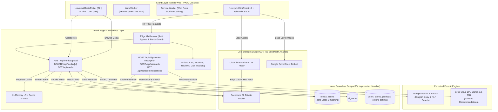

<div align="center">

# 👑 AALM VASTRALAY (आलम वस्त्रालय)
### *Next-Generation Indian Ethnic Wear & Bridal Multi-Vendor Marketplace*
#### *Enterprise Open-Source Turnkey E-Commerce Engine • 100% Perpetual $0/Month Infrastructure*

<br/>

[-000000?style=for-the-badge&logo=nextdotjs&logoColor=white)](https://nextjs.org/)
[](https://react.dev/)
[](https://www.typescriptlang.org/)
[](https://tailwindcss.com/)
[](https://neon.tech/)
[](https://orm.drizzle.team/)
[](docs/TECH_STACK_AND_ARCHITECTURE.md)
[](tests/)
[](https://workers.cloudflare.com/)
[](https://www.backblaze.com/b2/)
[](https://aistudio.google.com/)
[](https://groq.com/)
[-gold?style=for-the-badge&logo=googlecloud&logoColor=black)](docs/TECH_STACK_AND_ARCHITECTURE.md)

<br/>

**[🌐 Live Storefront](https://aalm-vastralay.vercel.app)** &nbsp;•&nbsp;
**[⚡ Admin Console](https://aalm-vastralay.vercel.app/admin)** &nbsp;•&nbsp;
**[🏪 Seller Hub](https://aalm-vastralay.vercel.app/seller)** &nbsp;•&nbsp;
**[📖 Architecture](docs/TECH_STACK_AND_ARCHITECTURE.md)** &nbsp;•&nbsp;
**[🚀 3-Minute Setup](docs/SETUP.md)**

<br/>

| ⚡ Production Readiness | 💰 Operating Cost | 🛡️ Security Architecture | 🧊 Cold Storage | 🦆 In-Memory OLAP | 🧪 Automated Tests |
| :---: | :---: | :---: | :---: | :---: | :---: |
| **Enterprise Ready** | **$0.00 / month** | **Self-Hosted PoW Bot Shield** | **0 Class C Transactions** | **DuckDB-Wasm Vector Engine** | **40/40 Test Suites (100%)** |

<br/>

> **Aalm Vastralay** is an enterprise-grade, high-performance Indian ethnic wear marketplace and **turnkey open-source multi-vendor e-commerce template**. Built on **Next.js 16 App Router**, **React 19**, and **Neon Serverless PostgreSQL**, the entire platform runs perpetually on **$0/month free tiers** — zero third-party captchas, zero fake reviews, zero recurring SaaS costs, zero data loss. Includes native Backblaze B2 cold media storage behind a Cloudflare CDN proxy, zero-cost Google Gemini + Groq AI engines, and interactive 1-click cloud setup.

</div>

---

## 🎬 Product Tour (1080p)

<div align="center">

<a href="brag-output/brag.mp4" title="Click to watch full 1080p video with audio">
  
</a>

<br/><br/>

<a href="https://github.com/SudhirDevOps1/aalm-vastralay/raw/main/brag-output/brag.mp4">
  
</a>
&nbsp;
<a href="https://aalm-vastralay.vercel.app">
  
</a>

<p align="center">
  <strong>"बेहतरीन क्वालिटी, उचित मूल्य — आपकी पसंद, हमारी पहचान"</strong><br/>
  <em>Royal Bridal Lehengas • Pure Banarasi Handloom • Regal Groom Sherwanis • Live WhatsApp Video Call • COD</em>
</p>

</div>

---

## 📑 Table of Contents

- [🛍️ Storefront Features](#️-storefront-features)
- [🏪 Seller Hub Features](#-seller-hub-features)
- [👑 Admin Console Features](#-admin-console-features)
- [🇮🇳 Indian Commerce Engine](#-indian-commerce-engine)
- [🧠 AI Engines](#-ai-engines)
- [🧊 Media & Cold Storage](#-media--cold-storage)
- [🛡️ Security Architecture](#️-security-architecture)
- [🏛️ System Architecture](#️-system-architecture)
- [🚀 Quick Start](#-quick-start)
- [🔑 Environment Variables](#-environment-variables)
- [🧪 Verification Suite](#-verification-suite)
- [☁️ Deployment](#️-deployment)
- [📚 Documentation](#-documentation)

---

## 🛍️ Storefront Features

Everything a shopper touches, engineered for slow Indian mobile networks (skeleton-first rendering, CLS ≈ 0).

| Area | What the customer gets |
| :--- | :--- |
| **Catalog & Discovery** | Typo-tolerant instant search, visual filters (Occasion, Color, Fabric), category navigation, sorting (rating, discount, price), SEO-friendly product pages with structured data |
| **Product Pages** | Image galleries with WebP compression, variant selection (size XS–XXL, color swatches), live stock indicators, GST-inclusive pricing, COD eligibility badges |
| **Cart & Wishlist** | Guest + authenticated carts, server-persisted wishlist, quantity controls with stock guards, double-click-safe checkout buttons |
| **Checkout** | Cash on Delivery, 0%-fee dynamic UPI QR with 5-minute expiry timer, 12-digit UTR verification flow, pincode serviceability check with delivery estimates |
| **Orders** | Live order tracking timeline, courier AWB integration (Shiprocket + Delhivery), printable GST invoices, return/cancel with reason codes |
| **Trust & Engagement** | Verified-purchase-only reviews with photos (zero fake reviews), WhatsApp video-call shopping, 1-click WhatsApp order confirmation, push notifications for dispatch |
| **Content** | Festive occasion collections (Wedding, Haldi, Mehendi, Sangeet), artisan store directory, personalized recommendations, marketing broadcasts |

---

## 🏪 Seller Hub Features

A complete vendor operating system at `/seller` — onboarding to payout.

| Area | What the seller gets |
| :--- | :--- |
| **Onboarding** | Guided registration with GSTIN capture, store profile builder, commission terms (6 months 0%, then 2.5%) |
| **Catalog Management** | Product CRUD with Hinglish AI copywriter, variant matrix (size × color), multi-image uploads via universal media picker, bulk stock updates |
| **Inventory** | Real-time stock ledger, low-stock alerts, variant-level quantities, out-of-stock auto-hiding |
| **Orders** | Vendor-scoped order inbox (strict store isolation — sellers never see other stores' data), status pipeline (confirmed → packed → shipped → delivered), customer contacts PII-masked |
| **Analytics** | DuckDB-Wasm in-browser OLAP: revenue trends, GMV slicing, GST summaries — sub-50ms on cached aggregates, zero Neon compute burn |
| **Payouts** | UPI-based settlement tracking, commission ledger, GST-compliant payout statements |

---

## 👑 Admin Console Features

A zero-code live studio at `/admin` — **105+ settings** editable without touching source code.

| Group | Capabilities |
| :--- | :--- |
| **Brand Identity** | Store name, tagline, logo variants, favicon, announcement marquee text & scroll speed, WhatsApp helpline, contact details, social handles |
| **Visual Theme** | Light/dark default, visitor theme toggle, Royal Maroon & Imperial Gold colorways, surfaces, corner radius, typography, density |
| **Homepage Layout** | 5-slide hero carousel manager, aspect ratios, slide ordering, badge texts, CTA links, section reordering, occasion chips, grid presets |
| **Indian Commerce** | INR formatting & rounding, free-shipping threshold, COD fees, return window, GST rates with HSN auto-split, catalog pagination |
| **Seller Hub** | Commission-free launch months, default commission %, listing auto-approval, GSTIN requirements, max images per listing |
| **Security & Bot Shield** | 10 PoW presentation archetypes, difficulty weight, iteration budget, rate-limit thresholds, lockout durations, session lifetimes, proxy trust flags |
| **Operations** | Order management across all stores, dynamic UPI UTR verification queue, coupon engine, marketing broadcasts, audit logs, banner editor, user & role management |

---

## 🇮🇳 Indian Commerce Engine

Purpose-built for how India actually buys — not a Western checkout clone.

| Capability | Implementation |
| :--- | :--- |
| **0%-Fee UPI Payments** | Real-time NPCI `upi://pay` QR generation with exact order amounts; 5-minute expiry timer; 12-digit UTR verification against bank statements with 1-click admin approval — saves the standard 2% gateway cut |
| **Cash on Delivery** | Pincode-prefix circle detection (Metro / Tier-1 / Tier-2 / Rural) with automatic COD eligibility resolution at checkout |
| **GST Compliance** | HSN-based tax auto-split (CGST/SGST/IGST), Rule 46 invoice wording, statutory invoice PDFs, GSTIN-printed seller documents |
| **Logistics** | Delhivery Express auto-routing for North & East hubs (Bihar, UP, Delhi), Shiprocket nationwide fallback, 1-click AWB generation with Code128 packing-slip barcodes |
| **Pincode Intelligence** | Prefix-based postal circle resolution with delivery-time estimates and COD serviceability flags |

---

## 🧠 AI Engines

100% free-tier cultural AI — no paid APIs, no credit card prerequisites.

| Engine | Model | What it does |
| :--- | :--- | :--- |
| **Luxury Copywriter** | Google Gemini 2.5 Flash (15 RPM / 1,500 RPD free) | Culturally authentic Hinglish product descriptions with traditional fabric vocabulary (*Zari, Banarasi, Katan, Anarkali, Sangeet, Karigari*), bullet points, SEO tags |
| **Recommendations** | Groq LPU · Llama 3.3 70B (~250ms) | Personalized cross-sell from browse history, cart contents, and festive season — non-blocking render |
| **Conversational Search** | Gemini 2.5 Flash (~600ms, in-memory tokenizer fallback) | Turns colloquial queries (*"behen ki shaadi ke liye royal blue banarasi saree under 7000"*) into structured DB filters (category, color, price, occasion, fabric) |
| **Seller Analytics** | DuckDB-Wasm in-process OLAP | Monthly GMV trends, inventory turnover, and ledger math offloaded from Neon — transactional DB stays lean |

All inference responses are cached in PostgreSQL (`ai_cache`) to stay inside free-tier quotas.

---

## 🧊 Media & Cold Storage

A storage architecture designed around Backblaze's free tier instead of against it.

| Capability | Implementation |
| :--- | :--- |
| **Zero-Egress CDN** | Private B2 bucket proxied through a Cloudflare Worker with 1-year immutable edge caching — **₹0 egress** via the Bandwidth Alliance |
| **Zero Class C Calls** | File metadata, keys, and B2 `fileId`s cached in Neon (`media_assets`); gallery reads run in **<10ms from PostgreSQL with 0 B2 API calls**, protecting the 2,500/day Class C quota |
| **Permanent Deletion** | Native `b2_delete_file_version` with stored `fileId` — instant purge, no hidden tombstones; lifecycle rule (`daysFromHidingToDeleting = 1`) garbage-collects the rest |
| **4-Source Media Picker** | Direct upload (streams to B2 via Worker) · Google Drive link (auto-canonicalized to `lh3.googleusercontent.com`, ₹0 hosting) · direct web link (on-the-fly `wsrv.nl` WebP) · paginated media library with 1-click reuse |
| **1-Command Setup** | `npm run setup:env` wizard configures Neon, secrets, B2, and AI keys, with 1-click Vercel env sync; `npm run setup:b2` deploys the CDN proxy |

```
[ Client Upload ] → [ Next.js API ] → [ Backblaze B2 ]
                                          │ returns fileId
                                          ▼
                        [ Neon media_assets ] ← metadata saved
                                │
                ┌───────────────┴───────────────┐
                ▼                               ▼
   [ Gallery = SELECT from DB ]     [ Delete = b2_delete_file_version ]
   (0 Class C B2 calls)             (hard purge, no tombstone)
```

---

## 🛡️ Security Architecture

Defense-in-depth, verified by OWASP ZAP baseline scans (0 High findings) and 38 automated suites.

| Vector | Defense |
| :--- | :--- |
| **Bots / Credential Stuffing** | Self-hosted click-to-solve Proof-of-Work (`ClickToSolve.tsx`) — Web Worker PBKDF2/SHA-256, 10 luxury archetypes (Turnstile card, ALTCHA, biometric, Shagun seal, swipe slider, invisible auto-solve). Zero Google/Cloudflare trackers |
| **Challenge Replay** | Single-use `pow_used` store (`ON CONFLICT DO NOTHING`), hourly pruning; tokens bound to IPv4 `/24` / IPv6 `/64` subnets (cellular-tower safe) |
| **DevTools Bypass** | Submit buttons cryptographically locked; Server Actions reject unverified payloads even after inspect-element tampering |
| **Secrets** | Fail-closed sentinels — production boot aborts on missing `AUTH_SECRET` / `ENCRYPTION_SECRET`; required-env guard with zero default secrets; secret rotation without redeploys |
| **Sessions** | Signed `HttpOnly` `SameSite=Lax` cookies, HMAC with per-user secret rotation on password change, fail-safe sign-out |
| **PII** | Automatic masking in admin/seller views and logs — phones (`9876****10`), emails (`r**@gmail.com`); sellers see only dispatch-required address fields (DPDP Act 2023 aligned) |
| **Headers** | Strict CSP (no wildcards), `CORP: same-origin`, `COEP: credentialless`, HSTS preload, `X-Content-Type-Options: nosniff`, `poweredByHeader: false` |
| **Crypto Hygiene** | `timingSafeEqual` on all token/signature comparisons; non-blocking async notification dispatch; scrypt password hashing |
| **Abuse & Errors** | Tiered rate limiting with IPv4/IPv6 anti-spoof validation and fail-closed sensitive routes; duplicate-order chaos guards (`useFormLock`); zero internal-error leakage to clients |
| **Data Safety** | Zero-loss migrations only (`ADD COLUMN IF NOT EXISTS`, safe defaults — never `DROP`); `withDbRetry` backoff armor for Neon blips |

---

## 🏛️ System Architecture


```mermaid
flowchart TD
    subgraph Client ["Client Layer (Mobile Web / PWA / Desktop)"]
        UI["Next.js 16 UI (React 19 + Tailwind CSS 4)"]
        WW["Web Worker (PBKDF2/SHA-256 PoW)"]
        SW["Service Worker (Web Push / Offline Caching)"]
        MediaModal["UniversalMediaPicker (B2 | GDrive | URL | DB)"]
    end

    subgraph EdgeServerless ["Vercel Edge & Serverless Layer"]
        MW["Edge Middleware (Anti-Bypass & Route Guard)"]
        MediaAPI["POST /api/media/upload\nDELETE /api/media/[id]\nGET /api/media"]
        AiAPI["POST /api/ai/generate-description\nPOST /api/ai/search\nGET /api/ai/recommendations"]
        CommerceAPI["Orders, Cart, Products, Reviews, GST Invoicing"]
        MemCache["In-Memory LRU Cache (<1ms)"]
    end

    subgraph CloudStorage ["Cold Storage & Edge CDN ($0 Bandwidth Alliance)"]
        CFW["Cloudflare Worker CDN Proxy"]
        B2["Backblaze B2 Private Bucket"]
        GDrive["Google Drive Direct Embed"]
    end

    subgraph FreeAI ["Perpetual Free AI Engines"]
        Gemini["Google Gemini 2.5 Flash\n(Hinglish Copy & NLP Search)"]
        Groq["Groq Cloud LPU Llama-3.3-70B\n(<300ms Recommendations)"]
    end

    subgraph Database ["Neon Serverless PostgreSQL (ap-south-1 Mumbai)"]
        MediaAssets[("media_assets\n(Zero Class C Caching)")]
        AiCache[("ai_cache")]
        CommerceDB[("users, stores, products, orders, settings")]
    end

    UI -->|HTTPS / Requests| MW
    MW --> MediaAPI
    MW --> AiAPI
    MW --> CommerceAPI

    MediaModal -->|Upload File| MediaAPI
    MediaAPI -->|Stream Buffer| B2
    B2 -->|Return fileId| MediaAPI
    MediaAPI -->|Save Metadata| MediaAssets
    MediaAPI -->|Populate Cache| MemCache

    MediaModal -->|Browse Media| MediaAPI
    MediaAPI -->|SELECT from DB| MediaAssets
    MediaAPI -.->|0 Calls to B2!| B2

    AiAPI -->|Description & Search| Gemini
    AiAPI -->|Recommendations| Groq
    AiAPI -->|Cache Inference| AiCache

    UI -->|Load Assets| CFW
    CFW -->|Edge Cache Hit / Fetch| B2
    UI -->|Load Drive Images| GDrive
```

Full blueprints: [Tech Stack & Architecture](docs/TECH_STACK_AND_ARCHITECTURE.md).

---

## 🚀 Quick Start

Get the full marketplace running locally in ~3 minutes.

### 1. Prerequisites
- **Node.js** `v20.x` or higher (`node -v`)
- **npm** `v10.x` or higher (`npm -v`)
- **Database:** free [Neon PostgreSQL](https://neon.tech) account (`ap-south-1 Mumbai` region)

### 2. Clone & Install
```bash
git clone https://github.com/SudhirDevOps1/aalm-vastralay.git
cd aalm-vastralay
npm install
```

### 3. Interactive Environment Setup
One wizard configures database, secrets, B2, and AI keys — and can sync everything to Vercel in 1 click:
```bash
npm run setup:env
```

### 4. Zero-Loss Database Migration
Creates all tables, indexes, and seed categories without dropping any data:
```bash
npm run db:auto-migrate
```

### 5. Launch
```bash
npm run dev
```
Open **[http://localhost:3000](http://localhost:3000)**. Default admin: `admin@aalmvastralay.com` / `Admin@123`.

---

## 🔑 Environment Variables

| Variable | Required | Purpose |
| :--- | :---: | :--- |
| `DATABASE_URL` | **Yes** | Neon PostgreSQL pooled connection string (`-pooler` endpoint, `ap-south-1`) |
| `AUTH_SECRET` | **Yes** | 64-char random hex for HMAC session-cookie signing (fail-closed in production) |
| `ENCRYPTION_SECRET` | **Yes** | 64-char random hex for AES-256-GCM field encryption (fail-closed in production) |
| `POW_SECRET` | **Yes** | Salt for signing Proof-of-Work challenge payloads |
| `GAS_SECRET_TOKEN` | **Yes** | Shared secret for the Google Apps Script mailer webhook (no default — must be set) |
| `NEXT_PUBLIC_SITE_URL` | **Yes** | Canonical URL (`http://localhost:3000` locally, production URL on Vercel) |
| `NEXT_PUBLIC_B2_WORKER_URL` | Optional | Cloudflare Worker B2 CDN proxy URL |
| `B2_BUCKET_NAME` / `B2_KEY_ID` / `B2_APPLICATION_KEY` | Optional | Backblaze B2 bucket + application key credentials |
| `GEMINI_API_KEY` | Optional | Google AI Studio key (Gemini 2.5 Flash copywriter + NLP search) |
| `GROQ_API_KEY` | Optional | Groq Console key (LPU recommendations) |
| `NEXT_PUBLIC_APP_NAME` | Optional | Storefront brand name |
| `NEXT_PUBLIC_UPI_VPA` | Optional | Store UPI ID for 0%-fee dynamic QR codes |
| `NEXT_PUBLIC_SUPPORT_PHONE` / `NEXT_PUBLIC_SUPPORT_EMAIL` | Optional | Customer-facing helpline contact details |
| `COOKIE_SECURE` | Optional | `"true"` on production HTTPS, `"false"` locally |

Generate production secrets per [ENV_VARS_PRODUCTION.md](docs/ENV_VARS_PRODUCTION.md) (256-bit crypto, zero-leak protocol).

---

## 🧪 Verification Suite

**40/40 enterprise suites, ~3.7 seconds.** Every change is verified before it ships:

```bash
npm test            # full enterprise suite (tests/run-all-tests.ts)
npm run typecheck   # TypeScript strict, 0 errors
npm run lint        # ESLint, 0 errors / 0 warnings
npm run build       # Next.js production build (mandatory before push)
```

Coverage spans encryption & PII masking, commerce math, auth & role hierarchy, seller tenant isolation, UPI QR + UTR, GST invoicing, courier AWB, PoW bot shield, fail-closed secrets, required-env guards, OAuth state safety, media/CDN thresholds, AI search intent, DuckDB analytics, and open-source template integrity.

---

## ☁️ Deployment

Production runs on perpetual free tiers — **$0/month**:

1. **Neon** — create a project in `Asia-Pacific (Mumbai) ap-south-1`, copy the **pooled** connection string.
2. **Cloudflare Worker CDN** — deploy the B2 proxy in 1 command:
   ```powershell
   npm run setup:b2
   ```
3. **Vercel** — import the repo, then run `npm run setup:env` locally to sync all production variables in 1 click (or set them manually in Project Settings). Deploy — build completes in ~90 seconds.

Runbooks: [Vercel](docs/VERCEL_DEPLOYMENT.md) · [Neon](docs/NEON_POSTGRESQL.md) · [Cloudflare Worker](docs/CLOUDFLARE_WORKER.md) · [Backblaze B2](docs/BACKBLAZE_B2.md) · [Master deployment guide](docs/DEPLOYMENT.md).

---

## 📚 Documentation

| Guide | Covers |
| :--- | :--- |
| ⭐ [Master Developer Guide](docs/MASTER_DEVELOPER_GUIDE.md) | Developer + operations runbook |
| 📜 [Architecture Laws (RULES)](docs/RULES.md) | Anti-yes-man principles, execution lifecycle, git discipline |
| 🐘 [Neon PostgreSQL](docs/NEON_POSTGRESQL.md) | Autoscaling Postgres 16, pooled Mumbai endpoint, zero-loss migrations |
| ⚡ [Vercel Deployment](docs/VERCEL_DEPLOYMENT.md) | Next.js 16 SSR/ISR, edge regions, zero-downtime releases, rollback |
| 🛡️ [Cloudflare Worker CDN](docs/CLOUDFLARE_WORKER.md) | $0 egress Bandwidth Alliance, KV token cache, HTTP 206 range seeking |
| 📦 [Backblaze B2 Storage](docs/BACKBLAZE_B2.md) | Private bucket, presigned browser uploads (bypasses Vercel 4.5MB ceiling), CORS |
| 📧 [GAS Mailer](docs/GAS_MAILER.md) | Free Gmail delivery, zero DNS setup, HMAC security, royal templates |
| 🔐 [Production Env Vars](docs/ENV_VARS_PRODUCTION.md) | Production secrets matrix, 256-bit key generation, zero leaks |
| 🏗️ [Tech Stack & Architecture](docs/TECH_STACK_AND_ARCHITECTURE.md) | Full blueprints, topology diagrams, storage flows |
| 🛠️ [Setup Guide](docs/SETUP.md) | Local development + production setup, step by step |
| 🗄️ [Database (.ai)](.ai/DATABASE.md) | Drizzle schemas, zero-loss migration protocol |
| 📋 [PRD (.ai)](.ai/PRD.md) | Product requirements & Indian ethnic commerce rules |
| 💡 [Decisions (.ai)](.ai/DECISIONS.md) | Architecture Decision Records |

---

<div align="center">

**Aalm Vastralay (आलम वस्त्रालय)** &nbsp;•&nbsp; Bihar, India
*Crafted with precision for Indian Commerce.*

</div>
