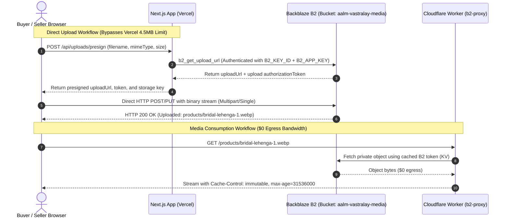

# 📦 Backblaze B2 — Master Object Storage & Direct Upload Guide
**Location:** `docs/BACKBLAZE_B2.md`  
**Bucket Name:** `aalm-vastralay-media` (Private)  
**CDN Integration:** Cloudflare Worker Proxy (`NEXT_PUBLIC_B2_WORKER_URL`)

---

## 📌 Architecture & Bandwidth Alliance Integration

Backblaze B2 provides enterprise-grade object storage at an ultra-low cost ($0.006/GB/month) with **10 GB always free**. 

Through the **Cloudflare Bandwidth Alliance**, downloading files from Backblaze B2 through a Cloudflare Worker incurs **$0 in egress bandwidth fees**.



---

## 🔑 Production Credentials & Bucket Setup

### Step 1: Create the Backblaze B2 Private Bucket
1. Log in to [secure.backblaze.com](https://secure.backblaze.com/).
2. Under **B2 Cloud Storage**, click **Buckets** -> **Create a Bucket**.
3. **Bucket Unique Name:** `aalm-vastralay-media` (must be globally unique; append your unique suffix if needed).
4. **Files in Bucket are:** **Private** (⚠️ Never make this Public).
5. **Default Encryption:** Enable (SSE-B2).
6. **Object Lock:** Disabled (unless strict legal compliance required).
7. Note down your **Bucket ID** (e.g., `4a5b6c7d8e9f...`).

---

### Step 2: Generate Dedicated Application Keys (Least Privilege)
Never use your Backblaze Master Application Key in production applications. Always create a restricted key:

1. In Backblaze Console, go to **Account** -> **Application Keys** -> **Add a New Application Key**.
2. **Name of Key:** `aalm-marketplace-prod`
3. **Allow access to Bucket(s):** Select only `aalm-vastralay-media`.
4. **Type of Access:** `Read and Write`
5. **File name prefix:** *(Leave blank for full bucket root)*
6. **Duration:** *(Leave blank for indefinite until manually rotated)*
7. Click **Create New Key**.

> [!CAUTION]
> Copy the **`keyID`** and **`applicationKey`** immediately. The `applicationKey` is shown **only once** upon generation.

```env
B2_KEY_ID="004e8b9a1c2d3e40000000001"
B2_APP_KEY="K004xYz123456789AbCdEfGhIjKlMn"
B2_BUCKET_ID="4a5b6c7d8e9f0123456789ab"
B2_BUCKET_NAME="aalm-vastralay-media"
```

---

## 🛡️ Production CORS Configuration

To allow sellers and customers to upload photos and videos directly from their browsers to B2 without triggering browser cross-origin blocks (`CORS policy: No 'Access-Control-Allow-Origin' header is present`), apply this CORS JSON rule to the bucket:

### Production CORS Rules JSON:
```json
[
  {
    "corsRuleName": "AalmVastralayDirectUpload",
    "allowedOrigins": [
      "https://aalmvastralay.com",
      "https://www.aalmvastralay.com",
      "https://aalm-vastralay.vercel.app"
    ],
    "allowedOperations": [
      "b2_upload_file",
      "b2_upload_part",
      "s3_put",
      "s3_post",
      "s3_head",
      "s3_get"
    ],
    "allowedHeaders": [
      "authorization",
      "content-type",
      "content-length",
      "x-bz-file-name",
      "x-bz-content-sha1",
      "x-bz-info-*",
      "x-amz-*"
    ],
    "exposeHeaders": [
      "x-bz-file-name",
      "x-bz-file-id",
      "x-bz-content-sha1",
      "x-bz-upload-timestamp"
    ],
    "maxAgeSeconds": 86400
  }
]
```

### Applying CORS via Backblaze B2 CLI:
```bash
# 1. Authorize B2 CLI
b2 authorize-account <B2_KEY_ID> <B2_APP_KEY>

# 2. Apply CORS JSON to bucket
b2 update-bucket --corsRules '[{"corsRuleName":"AalmVastralayDirectUpload","allowedOrigins":["https://aalmvastralay.com","https://www.aalmvastralay.com","https://aalm-vastralay.vercel.app"],"allowedOperations":["b2_upload_file","b2_upload_part","s3_put","s3_post","s3_head","s3_get"],"allowedHeaders":["authorization","content-type","content-length","x-bz-file-name","x-bz-content-sha1","x-bz-info-*","x-amz-*"],"exposeHeaders":["x-bz-file-name","x-bz-file-id","x-bz-content-sha1","x-bz-upload-timestamp"],"maxAgeSeconds":86400}]' aalm-vastralay-media allPrivate
```

---

## 📁 Storage Directory Structure & Filename Contract

Aalm Vastralay maintains a strictly partitioned bucket structure in `src/lib/b2.ts`:

```text
aalm-vastralay-media/
├── products/
│   ├── prod_clk123/
│   │   ├── hero_550e8400-e29b-41d4-a716-446655440000.webp
│   │   ├── detail_6ba7b810-9dad-11d1-80b4-00c04fd430c8.webp
│   │   └── drape-video_7c9e6679-7425-40de-944b-e07fc1f90ae7.mp4
├── brand/
│   ├── logo_royal_gold.svg
│   └── hero_festive_banner_2026.webp
└── avatars/
    └── user_9f7c2b4e.webp
```

### Strict Upload Constraints:
- **Allowed MIME Types:** `image/jpeg`, `image/png`, `image/webp`, `image/gif`, `video/mp4`, `video/webm`.
- **Image Size Limit:** Maximum 10 MB per image.
- **Video Size Limit:** Maximum 100 MB per video asset.
- **Path Traversal Shield:** Filenames are sanitized with UUIDv4; any `..`, `/`, or `\` is rejected.

---

## 🧹 Lifecycle Rules (Auto-Cleanup & Cost Control)

To ensure unused draft uploads and obsolete files do not inflate storage:
1. In Backblaze B2 Console, open your bucket: `aalm-vastralay-media`.
2. Click **Lifecycle Rules**.
3. Set rule:
   - **File prefix:** *(All files)*
   - **Action:** **Keep only the last version of the file**.
   - **Days until hidden files are deleted:** `7 days` (purges soft-deleted and overwritten objects after 1 week).

---

## 🧪 Production Upload Verification Script

You can verify that B2 authentication and upload authorization works in your production environment using Node.js:

```javascript
// scripts/verify-b2-prod.js
const { B2_KEY_ID, B2_APP_KEY, B2_BUCKET_ID } = process.env;

async function verifyB2() {
  console.log("Testing B2 Authentication...");
  const authRes = await fetch("https://api.backblazeb2.com/b2api/v2/b2_authorize_account", {
    headers: {
      Authorization: "Basic " + Buffer.from(`${B2_KEY_ID}:${B2_APP_KEY}`).toString("base64"),
    },
  });

  if (!authRes.ok) {
    throw new Error(`B2 Auth Failed: HTTP ${authRes.status} ${await authRes.text()}`);
  }

  const authData = await authRes.json();
  console.log("✅ B2 Authenticated! Download URL:", authData.downloadUrl);

  console.log("Testing Upload URL Generation...");
  const uploadRes = await fetch(`${authData.apiUrl}/b2api/v2/b2_get_upload_url`, {
    method: "POST",
    headers: {
      Authorization: authData.authorizationToken,
      "Content-Type": "application/json",
    },
    body: JSON.stringify({ bucketId: B2_BUCKET_ID }),
  });

  if (!uploadRes.ok) {
    throw new Error(`Get Upload URL Failed: HTTP ${uploadRes.status} ${await uploadRes.text()}`);
  }

  const uploadData = await uploadRes.json();
  console.log("✅ B2 Direct Upload URL Granted:", uploadData.uploadUrl);
  console.log("🎯 Backblaze B2 Storage is 100% Production Ready!");
}

verifyB2().catch(console.error);
```
