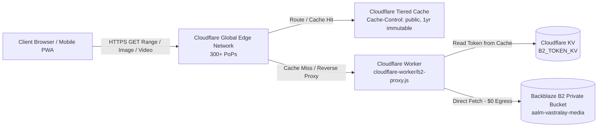

# 🛡️ Cloudflare Worker — Production Media CDN & B2 Reverse Proxy
**Location:** `docs/CLOUDFLARE_WORKER.md`  
**Worker Source:** `cloudflare-worker/b2-proxy.js`  
**Wrangler Configuration:** `cloudflare-worker/wrangler-b2-proxy.toml`

---

## 📌 Executive Architecture Overview

Aalm Vastralay utilizes an ultra-high performance, zero-cost egress architecture leveraging the **Cloudflare Bandwidth Alliance** and **Cloudflare Workers**. 



### Key Architectural Capabilities:
1. **$0 Egress Bandwidth Alliance:** Cloudflare and Backblaze B2 have zero data egress fees between their networks. High-resolution bridal videos and lehenga photography stream completely free.
2. **Strictly Private Bucket:** The Backblaze B2 bucket is **100% private**. The public internet cannot access raw B2 URLs, preventing data leakage and scraping.
3. **Cloudflare KV Token Caching (`B2_TOKEN_KV`):** B2 authentication tokens are cached in Cloudflare KV for 23 hours (B2 tokens are valid for 24 hours), avoiding redundant authentication roundtrips.
4. **Transparent 401 Auto-Retry (`X-Retry`):** If a cached token expires prematurely, the Worker catches the 401 status, flushes KV and memory cache, acquires a fresh upstream token, and retries the request once automatically.
5. **HTTP 206 Partial Content (Video Seeking):** Full support for HTTP `Range` headers, allowing video players on mobile and desktop to seek through high-definition product demonstration videos smoothly.
6. **50 MB Video Ceiling Protection:** Rejects oversized video stream proxying exceeding 50 MB with a clear 502 diagnostic JSON to prevent Worker compute limit exhaustion.
7. **Immutable Edge Caching:** Emits `Cache-Control: public, max-age=31536000, immutable` and `CDN-Cache-Control` headers for maximum caching across Cloudflare's 300+ edge points of presence.

---

## ⚙️ Wrangler Production Configuration

File: `cloudflare-worker/wrangler-b2-proxy.toml`

```toml
name = "aalm-b2-proxy"
main = "b2-proxy.js"
compatibility_date = "2024-09-23"
compatibility_flags = ["nodejs_compat"]

# 1. Cloudflare Account ID (Found on Cloudflare Dashboard right sidebar)
account_id = "YOUR_CLOUDFLARE_ACCOUNT_ID"

# 2. KV Namespace for B2 Auth Token Caching
[[kv_namespaces]]
binding = "B2_TOKEN_KV"
id = "YOUR_KV_NAMESPACE_ID"

# 3. Environment Variables (Non-sensitive)
[vars]
B2_BUCKET_NAME = "aalm-vastralay-media"

# 4. Optional Custom Domain Routing (Uncomment in production when domain is active on Cloudflare)
# routes = [
#   { pattern = "media.aalmvastralay.com/*", zone_name = "aalmvastralay.com" }
# ]
```

---

## 🛠️ Step-by-Step Production Deployment

### Prerequisites:
- Node.js 20+ installed
- Cloudflare Free or Pro Account ([dash.cloudflare.com](https://dash.cloudflare.com))
- Backblaze B2 Application Key (`keyID` and `applicationKey`) with read permissions for bucket `aalm-vastralay-media`.

### Step 1: Login to Cloudflare via Wrangler CLI
Navigate to the `cloudflare-worker` directory and authenticate:
```bash
cd cloudflare-worker
npx wrangler login
```
*(On headless servers or remote SSH, use `npx wrangler login --no-browser`)*

### Step 2: Create the KV Namespace
Create the production KV namespace to store temporary B2 auth tokens:
```bash
npx wrangler kv namespace create B2_TOKEN_KV --config wrangler-b2-proxy.toml
```
**Output Example:**
```text
🌀 Creating namespace with title "aalm-b2-proxy-B2_TOKEN_KV"
✨ Success!
Add the following to your configuration file in your kv_namespaces array:
[[kv_namespaces]]
binding = "B2_TOKEN_KV"
id = "4c52f9a716c04f9882208a101f3b3921"
```
Copy the returned `id` and paste it into `wrangler-b2-proxy.toml` under `[[kv_namespaces]]`.

### Step 3: Store Encrypted Secrets in Cloudflare
Never store sensitive keys in git or in `.toml` files. Store them using Wrangler's encrypted secrets store:

```bash
# 1. Backblaze Application Key ID (B2_KEY_ID)
npx wrangler secret put B2_KEY_ID --config wrangler-b2-proxy.toml
# When prompted: Enter your Backblaze B2 Key ID (e.g. 004e8b9...)

# 2. Backblaze Application Key (B2_APP_KEY)
npx wrangler secret put B2_APP_KEY --config wrangler-b2-proxy.toml
# When prompted: Enter your Backblaze B2 Application Key (e.g. K004...)
```

### Step 4: Deploy the Worker to Production
```bash
npx wrangler deploy --config wrangler-b2-proxy.toml
```

**Successful Output:**
```text
Total Upload: 4.82 KiB / gzip: 1.63 KiB
Uploaded aalm-b2-proxy (1.42 sec)
Deployed aalm-b2-proxy triggers (0.58 sec)
  https://aalm-b2-proxy.<your-subdomain>.workers.dev
Current Deployment ID: 8fd345b1-231f-4bb7-b12e-13c5457aa901
```

---

## 🌐 Custom Domain Setup (e.g., `media.aalmvastralay.com`)

If your domain DNS is managed by Cloudflare:
1. In Cloudflare Dashboard, open your zone: `aalmvastralay.com`.
2. Go to **Workers & Pages** -> **Routes** -> **Add route**.
3. **Route:** `media.aalmvastralay.com/*`
4. **Worker:** `aalm-b2-proxy`
5. Go to **DNS** -> **Records** -> **Add Record**:
   - **Type:** `CNAME`
   - **Name:** `media`
   - **Target:** `aalm-b2-proxy.<your-subdomain>.workers.dev` (or `100::` dummy IPv6)
   - **Proxy status:** **Proxied (Orange Cloud ON)**

Now your media URL will be:  
`https://media.aalmvastralay.com/products/bridal-lehenga-red.webp`

---

## 🧪 Production Verification & Testing Commands

### 1. Health & Startup Configuration Test
Verify that the worker starts cleanly and responds to `GET` requests:
```bash
curl -I https://aalm-b2-proxy.<your-subdomain>.workers.dev/products/test-image.webp
```

**Expected Response Headers:**
```http
HTTP/2 200
content-type: image/webp
cache-control: public, max-age=31536000, immutable
cdn-cache-control: public, max-age=31536000
access-control-allow-origin: *
access-control-allow-methods: GET, HEAD, OPTIONS
cf-cache-status: HIT
```

### 2. Video Range / Partial Content Test (HTTP 206)
Verify that video seeking works through the proxy:
```bash
curl -I -H "Range: bytes=0-1024" https://aalm-b2-proxy.<your-subdomain>.workers.dev/videos/saree-drape-demo.mp4
```

**Expected Response Headers:**
```http
HTTP/2 206 Partial Content
content-range: bytes 0-1024/15482931
accept-ranges: bytes
content-length: 1025
content-type: video/mp4
```

### 3. Live Log Tail in Realtime
Monitor live worker requests, cache hits, and errors in production:
```bash
npx wrangler tail aalm-b2-proxy --config wrangler-b2-proxy.toml
```

---

## 🚨 Troubleshooting & Error Diagnostics

| HTTP Status | Error Message / Cause | Production Solution |
|:---|:---|:---|
| **502 Bad Gateway** | `Cloudflare Worker misconfigured! Missing required environment variables` | Verify secrets: run `npx wrangler secret list --config wrangler-b2-proxy.toml`. Ensure `B2_KEY_ID`, `B2_APP_KEY`, and `B2_BUCKET_NAME` exist. |
| **401 Unauthorized** | Upstream B2 token rejected | The worker will automatically retry once with `X-Retry: 1`. If persistent, ensure the Backblaze application key has not been deleted or revoked in the Backblaze console. |
| **404 Not Found** | `B2 object not found: /products/...` | The file does not exist in bucket `aalm-vastralay-media`. Check filename casing and upload prefix. |
| **405 Method Not Allowed** | `Method not allowed` | Only `GET` and `HEAD` requests are permitted. File uploads must go directly to B2 via client-side presigned URLs. |
| **502 Bad Gateway** | `Video exceeds 50MB proxy limit` | Compress the video with H.264/H.265 or WebM under 50 MB before uploading. |
