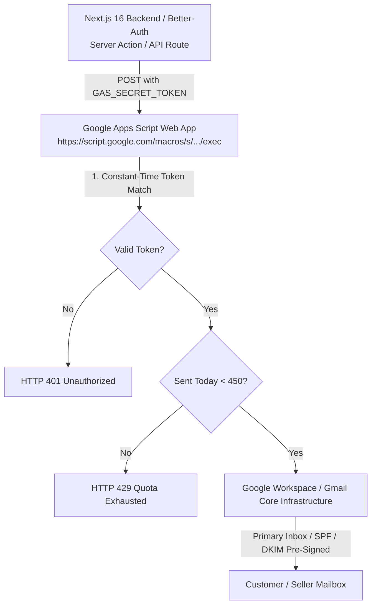

# 📧 Google Apps Script (GAS) — Master Transactional Mailer Guide
**Location:** `docs/GAS_MAILER.md`  
**Script Source:** `scripts/gas-webhook-code.gs`  
**Client Implementation:** `src/lib/gas-mailer.ts` & `src/lib/email.ts`

---

## 📌 Architecture & Delivery Engine Overview

Aalm Vastralay eliminates monthly fees for transactional email delivery (saving \$20–\$80/month on Resend/SendGrid/SES) while achieving **near-100% primary inbox deliverability** using a secure Google Apps Script Web App.



### Why GAS Mailer Outperforms Traditional SMTP:
1. **₹0 Forever Cost:** No subscriptions, no credit card required.
2. **Zero DNS Hassles:** No configuring MX records, SPF TXT records, DKIM public keys, or DMARC policies.
3. **Guaranteed Inbox Placement:** Emails originate directly from Google's high-reputation IP blocks, virtually eliminating spam folder filtering.
4. **Safety Circuit Breaker:** Google grants 500 emails/day for free `@gmail.com` accounts and 2,000 emails/day for Google Workspace. The script caps operations at 450 emails/day to preserve a safety buffer.
5. **Royal Ethnic Email Templates:** Includes 10 responsive, luxury-themed HTML email templates designed for Indian wedding and ethnic fashion.

---

## 📜 Complete Production Script (`scripts/gas-webhook-code.gs`)

Copy the entire contents of [`scripts/gas-webhook-code.gs`](../scripts/gas-webhook-code.gs) into your Google Apps Script editor. Key architectural points:

```javascript
// 🔒 Shared Secret Token (Must match GAS_SECRET_TOKEN in Next.js .env)
var GAS_SECRET_TOKEN = "aalm_gas_mail_secret_9988224411";

// 👑 Brand Identity & Safety Limits
var BRAND_NAME = "आलम वस्त्रालय (Aalm Vastralay)";
var BRAND_REPLY_TO = "support@aalmvastralay.com";
var DAILY_QUOTA_LIMIT = 450;
```

---

## 🛠️ Step-by-Step Production Deployment

### Step 1: Create the Project in Google Apps Script
1. Visit [script.google.com/home](https://script.google.com/home) in your browser.
2. Log in with the dedicated store email account (e.g. `aalmvastralay@gmail.com`).
3. Click **+ New project**.
4. Rename the project from *Untitled project* to:  
   👉 **`Aalm-Vastralay-Auth-Mailer`**

### Step 2: Paste the Production Code
1. Erase any default code in `Code.gs`.
2. Paste the full script from [`scripts/gas-webhook-code.gs`](../scripts/gas-webhook-code.gs).
3. Set your production secret token at the top:
   ```javascript
   var GAS_SECRET_TOKEN = "aalm_gas_mail_secret_9988224411";
   ```
4. Click the **Save** (💾) icon.

### Step 3: Deploy as a Public Web App
1. Click the blue **Deploy** button (top right) -> **New deployment**.
2. Click the gear icon (⚙️) next to *Select type* and select **Web app**.
3. Fill in the deployment parameters:
   - **Description:** `Production Transactional Mailer v1`
   - **Execute as:** `Me (aalmvastralay@gmail.com)`
   - **Who has access:** **`Anyone`** *(⚠️ Mandatory: Selecting "Anyone" allows your Next.js server to send requests without OAuth popups).*
4. Click **Deploy**.

### Step 4: Authorize Google Account Permissions
1. Click **Authorize access**.
2. Select your Google account.
3. If Google displays *"Google hasn’t verified this app"*:
   - Click **Advanced** (bottom left).
   - Click **Go to Aalm-Vastralay-Auth-Mailer (unsafe)**.
   - Click **Allow**.
4. Copy the resulting **Web app URL**:
   ```text
   https://script.google.com/macros/s/AKfycbzAbCdEf123456789_xYz/exec
   ```

### Step 5: Store in Next.js Environment Variables
Add both variables to your Vercel Project and local `.env.production`:
```env
GAS_WEBHOOK_URL="https://script.google.com/macros/s/AKfycbzAbCdEf123456789_xYz/exec"
GAS_SECRET_TOKEN="aalm_gas_mail_secret_9988224411"
```

---

## 📨 Supported Transactional Email Payloads

The Next.js client (`src/lib/gas-mailer.ts`) supports the following typed events:

| Email Event (`type`) | Purpose | Key Payload Fields |
|:---|:---|:---|
| `FORGOT_PASSWORD` | Password Reset 6-Digit OTP | `to`, `otp`, `name` |
| `ORDER_CONFIRMATION` | Successful Order Placement | `to`, `orderId`, `amount`, `name` |
| `ORDER_DISPATCHED` | Courier tracking & dispatch | `to`, `orderId`, `courier`, `awb`, `trackingUrl` |
| `UPI_VERIFIED` | Payment confirmation | `to`, `orderId`, `name` |
| `SELLER_WELCOME` | Seller onboarding approval | `to`, `name` |
| `RETURN_REQUESTED` | Return/Exchange ticket | `to`, `orderId`, `name` |
| `FESTIVAL_OFFER` | Diwali / Eid / Chhath Campaign | `to`, `festivalName`, `discountText`, `headline` |
| `COUPON_OFFER` | Personalized Promo Voucher | `to`, `couponCode`, `discountText` |

---

## 🧪 Production Verification & Testing Commands

### 1. Health & Quota Inspection (GET)
Verify the webhook is online and check remaining daily quota:
```bash
curl "https://script.google.com/macros/s/YOUR_DEPLOYMENT_ID/exec?token=aalm_gas_mail_secret_9988224411"
```

**Expected JSON Response:**
```json
{
  "status": "ok",
  "service": "Aalm Vastralay GAS Mailer Webhook",
  "remainingDailyQuota": 450,
  "timestamp": "2026-09-29T06:00:00.000Z"
}
```

### 2. Live Test OTP Email Dispatch (POST)
Send a test OTP to your own email address:

#### Bash / Linux:
```bash
curl -X POST "https://script.google.com/macros/s/YOUR_DEPLOYMENT_ID/exec" \
  -H "Content-Type: application/json" \
  -d '{
    "token": "aalm_gas_mail_secret_9988224411",
    "type": "FORGOT_PASSWORD",
    "to": "your-email@gmail.com",
    "otp": "848101",
    "name": "Test Customer"
  }'
```

#### Windows (PowerShell):
```powershell
$body = @{
    token = "aalm_gas_mail_secret_9988224411"
    type  = "FORGOT_PASSWORD"
    to    = "your-email@gmail.com"
    otp   = "848101"
    name  = "Test Customer"
} | ConvertTo-Json

Invoke-RestMethod -Method Post -Uri "https://script.google.com/macros/s/YOUR_DEPLOYMENT_ID/exec" -ContentType "application/json" -Body $body
```

**Expected JSON Response:**
```json
{
  "status": "ok",
  "message": "Email sent successfully",
  "recipient": "your-email@gmail.com",
  "type": "FORGOT_PASSWORD",
  "remainingDailyQuota": 449
}
```

---

## 🚨 Troubleshooting & Diagnostics

| Symptom | Cause | Resolution |
|:---|:---|:---|
| **HTTP 401 Unauthorized** | Token mismatch | Check `GAS_SECRET_TOKEN` in `.env` matches `GAS_SECRET_TOKEN` in `Code.gs`. |
| **HTTP 302 Redirect Loop** | Web app access permission not set to "Anyone" | Re-deploy script: **Deploy -> Manage deployments -> Edit -> Who has access: Anyone**. |
| **HTTP 429 Quota Exhausted** | Daily quota limit reached | The script automatically prevents exceeding Google's threshold. Quota resets at 12:00 AM Pacific Time. For higher limits, connect a Google Workspace account (2,000/day). |
| **Email Delayed** | Gmail anti-abuse throttling | Avoid blasting bulk batches synchronously. Next.js calls the mailer asynchronously in background server actions. |
