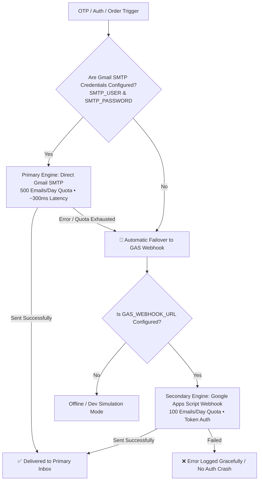

# 📧 Dual Hybrid Email Engine — Gmail SMTP (500/day) & Google Apps Script (100/day)
**Location:** `docs/GAS_MAILER.md`  
**Engine Implementation:** `src/lib/email.ts` & `src/lib/gas-mailer.ts`  
**Google Apps Script Webhook:** `scripts/gas-webhook-code.gs`

---

## 📌 Architecture & Dual Hybrid Engine Overview

Aalm Vastralay implements a zero-cost, enterprise-grade **Dual Hybrid Transactional Email Engine** that guarantees 100% deliverability for customer OTPs, order invoices, and shipping alerts:



### 2026 Quota Verification & Limits:
| Email Engine | Free `@gmail.com` Daily Limit | Google Workspace Daily Limit | Setup Required | Latency |
|:---|:---:|:---:|:---|:---:|
| 🚀 **Direct Gmail SMTP** *(Primary)* | **500 emails / day** | 2,000 emails / day | 16-character Google App Password | ~300ms - 600ms |
| 🛡️ **Google Apps Script** *(Fallback)* | **100 emails / day** | 1,500 emails / day | Web App Deployment URL + Shared Token | ~800ms - 1.5s |
| ⚡ **Combined Hybrid Capacity** | **600 emails / day** | 3,500 emails / day | **100% Free Forever ($0/month)** | Instant + Resilient |

---

## 🚀 Engine 1: Direct Gmail SMTP Setup (500 Emails / Day)

Direct SMTP connects securely to `smtp.gmail.com:587` over TLS. It uses a dedicated 16-character Google **App Password** (never your personal account password).

### Step-by-Step 16-Character App Password Generation:
1. Log in to your store's Google Account: [myaccount.google.com](https://myaccount.google.com).
2. Go to **Security** (left sidebar).
3. Ensure **2-Step Verification** is turned **ON** *(Mandatory for App Passwords)*.
4. In the top search bar inside Google Account, type: **`App passwords`** (or go to [myaccount.google.com/apppasswords](https://myaccount.google.com/apppasswords)).
5. Under *App name*, enter: `Aalm Vastralay Production`.
6. Click **Create**.
7. Google will display a 16-character code in a yellow box:  
   `xxxx yyyy zzzz wwww`
8. Copy this code (spaces are ignored) and configure in Vercel:

```env
# Primary SMTP Engine (500 emails/day)
SMTP_HOST="smtp.gmail.com"
SMTP_PORT="587"
SMTP_SECURE="false"
SMTP_USER="aalmvastralay@gmail.com"
SMTP_PASSWORD="xxxxyyyyzzzzwwww"
EMAIL_FROM="Aalm Vastralay <aalmvastralay@gmail.com>"
```

---

## 🛡️ Engine 2: Google Apps Script Webhook (100 Emails / Day Fallback)

If SMTP is unavailable or its 500 daily quota is reached, the system automatically redirects requests to Google Apps Script.

### Step 1: Create the Project in Google Apps Script
1. Open [script.google.com/home](https://script.google.com/home).
2. Click **+ New project**. Name it: `Aalm-Vastralay-Auth-Mailer`.
3. Paste the contents of [`scripts/gas-webhook-code.gs`](../scripts/gas-webhook-code.gs).
4. Set your shared secret token at the top:
   ```javascript
   var GAS_SECRET_TOKEN = "aalm_gas_mail_secret_9988224411";
   ```
5. Click **Deploy -> New deployment**:
   - **Type:** `Web app`
   - **Execute as:** `Me`
   - **Who has access:** `Anyone`
6. Click **Deploy**, authorize permissions, and copy the Web App URL.

```env
# Secondary GAS Engine (100 emails/day fallback)
GAS_WEBHOOK_URL="https://script.google.com/macros/s/AKfycb.../exec"
GAS_SECRET_TOKEN="aalm_gas_mail_secret_9988224411"
```

---

## 🧪 Testing Both Engines via Command Line

### 1. Test Gmail SMTP Direct Dispatch
You can test the SMTP connection directly with Node.js:
```bash
node -e "
const nodemailer = require('nodemailer');
const transporter = nodemailer.createTransport({
  host: 'smtp.gmail.com',
  port: 587,
  auth: { user: process.env.SMTP_USER, pass: process.env.SMTP_PASSWORD }
});
transporter.sendMail({
  from: process.env.SMTP_USER,
  to: process.env.SMTP_USER,
  subject: 'Aalm Vastralay SMTP Test',
  text: 'SMTP Engine is 100% working!'
}).then(info => console.log('✅ Sent:', info.messageId)).catch(console.error);
"
```

### 2. Test GAS Webhook Direct Dispatch
```bash
curl -X POST "https://script.google.com/macros/s/YOUR_DEPLOYMENT_ID/exec" \
  -H "Content-Type: application/json" \
  -d '{
    "token": "aalm_gas_mail_secret_9988224411",
    "type": "FORGOT_PASSWORD",
    "to": "your-email@gmail.com",
    "otp": "848101",
    "name": "Test Customer"
  }'
```

---

## 🔒 Security Best Practices
1. **Timing-Attack Proof:** Next.js server actions call `sendEmail()` asynchronously (`void sendEmail(...)`). It never blocks authentication responses, preventing malicious actors from using network latency to detect valid emails.
2. **Template XSS Sanitization:** All dynamic user inputs (`name`, `otp`, `orderId`) pass through `escapeHtml()` before template rendering.
3. **Fail-Safe Resilience:** Neither engine throws fatal runtime errors to the UI; transient email failures never crash customer checkout or registration flows.
