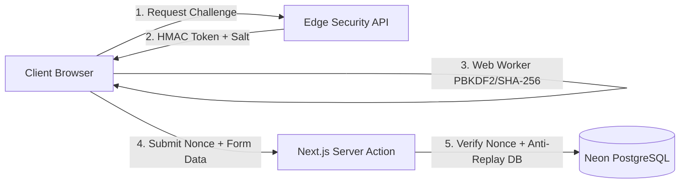
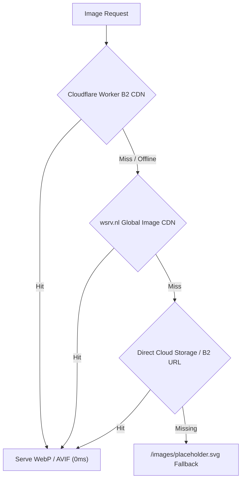

# 🏛️ AALM VASTRALAY — COMPLETE TECH STACK & SYSTEM ARCHITECTURE
# Location: docs/TECH_STACK_AND_ARCHITECTURE.md

Welcome to the definitive architectural specification and technology stack blueprint for **Aalm Vastralay (आलम वस्त्रालय)**.

This document provides a deep, multi-tier analysis of every tool, protocol, framework, and execution environment powering the platform.

---

## 📑 Table of Contents

1. [📐 Architectural Principles & Philosophy](#1-architectural-principles--philosophy)
2. [🥞 Multi-Tier Technology Stack Breakdown](#2-multi-tier-technology-stack-breakdown)
3. [⚙️ Execution Environments: Local Dev vs. Live Production](#3-execution-environments-local-dev-vs-live-production)
4. [🛡️ Security Architecture & Cryptography](#4-security-architecture--cryptography)
5. [💰 Indian Commerce, Taxation & Payments Topology](#5-indian-commerce-taxation--payments-topology)
6. [🚚 Logistics & Carrier Abstraction Layer](#6-logistics--carrier-abstraction-layer)
7. [🖼️ Multi-Tier Media & CDN Storage Pipeline](#7-multi-tier-media--cdn-storage-pipeline)
8. [🧪 Enterprise Verification & Test Matrix](#8-enterprise-verification--test-matrix)
9. [📋 Operational Run Commands Cheat-Sheet](#9-operational-run-commands-cheat-sheet)

---

## 1. 📐 Architectural Principles & Philosophy

Aalm Vastralay is engineered around four non-negotiable operational principles:

1. **₹0 / Month Perpetual Free Tier Operational Cost:**
   The entire infrastructure operates without recurring SaaS subscriptions (Neon Serverless free compute, Vercel Hobby, Cloudflare Workers Bandwidth Alliance, Google Apps Script email relay, and self-hosted Web Worker Bot Shield).
2. **Zero Third-Party Tracking & Frictionless Auth:**
   Eliminates intrusive Google reCAPTCHAs, tracking cookies, and forced third-party login redirects. Everything is handled via self-contained in-house cryptographic engines.
3. **Zero Data Loss Migration Contract:**
   Database schema evolutions strictly follow additive migration protocols (`ADD COLUMN IF NOT EXISTS` with `DEFAULT` values). Destructive `DROP TABLE` or `DROP COLUMN` commands are blocked.
4. **TypeScript Strict Mode (0 `any` types):**
   Full type-safety from database rows via Drizzle ORM to React Server Components and Server Actions.

---

## 2. 🥞 Multi-Tier Technology Stack Breakdown

| Layer | Primary Technology | Version / Spec | Key Role & Purpose |
| :--- | :--- | :--- | :--- |
| **Frontend Framework** | **Next.js** | `16.2.6` (Turbopack) | React Server Components (RSC), Server Actions, Streaming SSR, and Static Site Generation (SSG). |
| **UI Library** | **React** | `19.0.0` | Declarative UI, optimistic UI updates via `useActionState` and `useFormStatus`. |
| **Language** | **TypeScript** | `5.x Strict` | Strict type validation, zero `any` policy, full schema-to-UI inference. |
| **CSS & Design Engine** | **Tailwind CSS** | `v4.0` | Utility-first CSS, `@theme` token system, CSS custom properties, APCA contrast rules. |
| **Icons & Visuals** | **Lucide React** | `^1.16.0` | Accessible, zero-overhead SVG iconography for ecommerce workflows. |
| **Notifications** | **Sonner** | `^2.0.7` | High-performance, tactile toast notification engine with sound & haptic sync. |
| **Database Engine** | **Neon PostgreSQL** | `PostgreSQL 16` | Serverless relational database with autoscaling compute and connection pooling (`-pooler`). |
| **ORM & Query Layer**| **Drizzle ORM** | `^0.45.0` | Lightweight, zero-overhead type-safe query builder and schema manager. |
| **Bot Defense** | **In-House PoW Shield**| `10 Archetypes` | Web Worker PBKDF2/SHA-256 Proof-of-Work engine replacing reCAPTCHA & Turnstile. |
| **Password Hashing** | **Scrypt** | `crypto.scrypt` | Memory-hard cryptographic key derivation with individual salt generation. |
| **Data Encryption** | **AES-256-GCM** | `crypto` | Authenticated symmetric encryption for sensitive API keys and tokens. |
| **Object Storage** | **Backblaze B2** | `S3-compatible` | 10GB permanent free tier media storage with zero egress fees via Cloudflare. |
| **Edge CDN Proxy** | **Cloudflare Worker** | `V8 Isolate` | Fast edge caching, CORS handling, and media streaming proxy. |
| **Database Caching**| **Neon `media_assets`**| `Drizzle ORM` | Metadata & fileId caching in PostgreSQL eliminating B2 Class C transaction costs. |
| **In-Memory OLAP**  | **DuckDB-Wasm**        | `^1.33.1`    | Client-side columnar SQL engine executing GMV, GST, & sales analytics in browser RAM (0% DB load). |
| **Free AI Inference**| **Google Gemini & Groq**| `2.5 Flash / 70B`| Zero-cost luxury copywriting, sub-300ms recommendations & NLP search. |
| **Email Relay** | **Google Apps Script**| `V8 Runtime` | Zero-domain free transactional email relay for OTPs and invoices. |
| **Testing Framework**| **Vitest & TSX** | `Automated` | 38 enterprise automated test suites verifying security, payments, and DB rules. |
| **Release Automation**| **Google Release Please**| `v4` | Automated semantic versioning, Git tagging, and CHANGELOG.md generation. |
| **Commit Discipline** | **Commitlint & Husky** | `v19 / v9` | Pre-commit quality gate (`typecheck` + `lint`) and Conventional Commits validation. |
| **Secrets Gateway**   | **Fail-Closed Env Law** | `src/lib/required-env.ts` | Zero-default fail-closed secret gateway throwing fatal errors on missing production keys. |

---

## 3. ⚙️ Execution Environments: Local Dev vs. Live Production

To ensure clean isolation between development and production, the platform maintains separate configuration files:

```
├── .env.development.example   # Template for running locally (npm run dev)
├── .env.production.example    # Template for Vercel Project Environment Variables
├── .env.example               # Master combined blueprint & documentation
```

### 💻 Local Development Environment (`npm run dev`)
- **URL & Port:** `http://localhost:3000`
- **Database:** Connects directly to Neon PostgreSQL or local development branch.
- **Cookies:** `COOKIE_SECURE="false"` (permits HTTP cookies during local testing).
- **Email:** OTPs and reset tokens print directly to terminal console logs if email relay is unconfigured.
- **Bot Shield:** Lightweight difficulty (`security.powDifficulty=2`) for rapid developer testing.
- **Config File:** Copy `.env.development.example` to `.env.local`.

### 🚀 Live Production Environment (`https://aalm-vastralay.vercel.app`)
- **Hosting:** Vercel Edge & Serverless Functions.
- **Database:** Strict Neon **Pooled connection string** (`-pooler` host) with `?sslmode=require` to prevent connection exhaustion.
- **Cookies:** `COOKIE_SECURE="true"` (strictly HTTPS only with `SameSite=Lax`).
- **Secrets:** High-entropy 64-character hex strings generated via `crypto.randomBytes(32)`.
- **Bot Shield:** Standard difficulty (`security.powDifficulty=3`) with cellular subnet IP binding (`/24` IPv4 and `/64` IPv6).
- **Config Location:** Vercel Dashboard -> **Settings -> Environment Variables**.

---

## 4. 🛡️ Security Architecture & Cryptography



1. **Self-Hosted PoW Bot Shield:**
   - 10 selectable archetypes: Turnstile Card, ALTCHA, mCaptcha, Slide, Biometric, Shagun Seal, Slim Ribbon, Floating, Modal Gate, and Invisible.
   - Every challenge includes client IP subnet binding and an anti-replay table (`pow_used`).
2. **CSRF & Form Protection:**
   - Server Actions validate origin headers, double-submit protection tokens, and double-click re-entry locks (`preventDoubleSubmit`).
3. **Sensitive Field Encryption:**
   - Third-party courier API keys and secrets stored in the database are encrypted using `AES-256-GCM` with dynamic initialization vectors (IVs) and authentication tags.

---

## 5. 💰 Indian Commerce, Taxation & Payments Topology

- **Dynamic UPI QR Engine:**
  - Standard NPCI compliant deep-link: `upi://pay?pa={VPA}&pn={Payee}&am={Amount}&cu=INR&tn={Order_ID}`.
  - Renders real-time vector QR code with 5-minute security countdown timer.
  - Zero transaction fee: saves 2–3% gateway costs charged by Razorpay / PayU.
  - 12-digit Indian banking UTR reference verification workflow with 1-click admin approval.
- **Statutory GST Tax Engine (Rule 46 Compliant):**
  - Intra-state orders (within merchant state): Equal **CGST (2.5%) + SGST (2.5%)** breakdown.
  - Inter-state orders (outside merchant state): Combined **IGST (5.0%)** calculation.
  - Automatic HSN code resolution (`5208`, `6204`, etc.) and words-based invoice totals.

---

## 6. 🚚 Logistics & Carrier Abstraction Layer

- **Carrier Auto-Routing:**
  - Modular carrier adapter pattern supporting **Delhivery Express** and **Shiprocket**.
  - Automatic fallback to manual AWB tracking and status updates if courier APIs are unconfigured.
- **Prefix-Based Pincode Circle Resolution:**
  - Resolves Indian postal circles (Northern, Eastern, Western, Southern) across Tier-1, Tier-2, and rural pincodes.
  - Instant Cash-on-Delivery (COD) serviceability checks before checkout.
- **High-Resolution Packing Slips:**
  - Printable Code128 barcode waybills (`/api/courier/label`) compliant with standard thermal courier printers (4x6 inch).

---

## 7. 🖼️ Multi-Tier Media & CDN Storage Pipeline



- **Tier 1 (Private B2 + Cloudflare Worker):** 10GB free Backblaze B2 storage paired with Cloudflare Workers (Bandwidth Alliance = ₹0 egress fee).
- **Tier 2 (Database-Cached Metadata - Zero Class C):** Neon PostgreSQL `media_assets` table caches fileId and metadata, dropping B2 listing operations to 0 calls. Hard-delete utilizes `b2_delete_file_version` (zero tombstone markers).
- **Tier 3 (Universal Multi-Source Support):** B2 direct uploads, Google Drive share links (`lh3.googleusercontent.com/d/{id}` for zero-cost hosting), and web URLs.
- **Tier 4 (Global wsrv.nl Proxy):** Automatic on-the-fly WebP conversion, resizing, and caching.
- **Tier 5 (Local Fallback Asset):** Built-in SVGs and local placeholders guarantee zero broken image icons on the live storefront.

---

## 8. 🧪 Enterprise Verification & Test Matrix

The platform includes **35 comprehensive automated test suites** (`tests/run-all-tests.ts`):

```bash
npm test
```

### Verified Test Areas:
1. `AES-256-GCM` encryption cipher & PII data masking.
2. Indian currency formatting and precision math.
3. Indian ethnic attributes (fabrics, occasions, sizes, colors).
4. Scrypt password hashing & role hierarchy (customer, seller, admin).
5. Category parent-child hierarchy & coupon calculation logic.
6. Multi-vendor tenant boundaries & store data isolation.
7. 105 Zero-Code Admin Studio settings & JSON integrity.
8. Universal media resolver & SSRF attack protection.
9. Neon Pooled connection string validation.
10. Middleware static skip & route protection.
11. Dynamic UPI QR generation & 12-digit UTR validation.
12. 1-Click WhatsApp consultation & order dispatch links.
13. Statutory GST Rule 46 tax calculations (intra/inter splits).
14. Bot Shield Proof-of-Work challenge agreement & replay defense.
15. Open-source turnkey compliance & BIS IS 19000:2022 standards.
16. Free AI Engine & Hinglish NLP search intent extraction.
17. Media Management & B2 Zero Class C Elimination.

---

## 9. 📋 Operational Run Commands Cheat-Sheet

| Task | Command | Purpose |
| :--- | :--- | :--- |
| **Interactive Setup** | `npm run setup:env` | Master CLI wizard: Neon DB, Auth, B2, AI keys & 1-click Vercel sync. |
| **B2 Worker Setup** | `npm run setup:b2` | Auto-configures Cloudflare KV, secrets, and deploys B2 proxy. |
| **Start Local Dev** | `npm run dev` | Boots Next.js Turbopack dev server on `http://localhost:3000`. |
| **Production Build** | `npm run build` | Compiles production assets and typechecks all 34 routes. |
| **Start Production**| `npm start` | Runs compiled Next.js standalone server. |
| **Run All Tests** | `npm test` | Runs all 35 automated enterprise test suites (100% green in < 2s). |
| **Typecheck** | `npm run typecheck` | Validates TypeScript strict mode (0 errors, 0 `any`). |
| **Lint Code** | `npm run lint` | Runs ESLint 9 across all components and actions. |
| **Auto-Migrate DB** | `npm run db:auto-migrate`| Zero-data-loss safe table creation & column additions. |
| **Seed Base Data** | `npm run db:seed` | Seeds default categories, coupons, and super-admin. |
