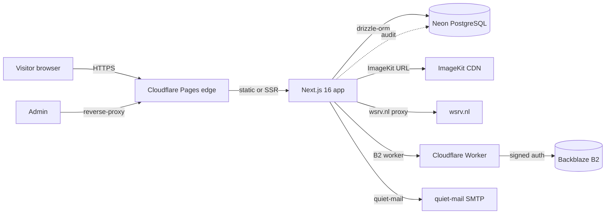
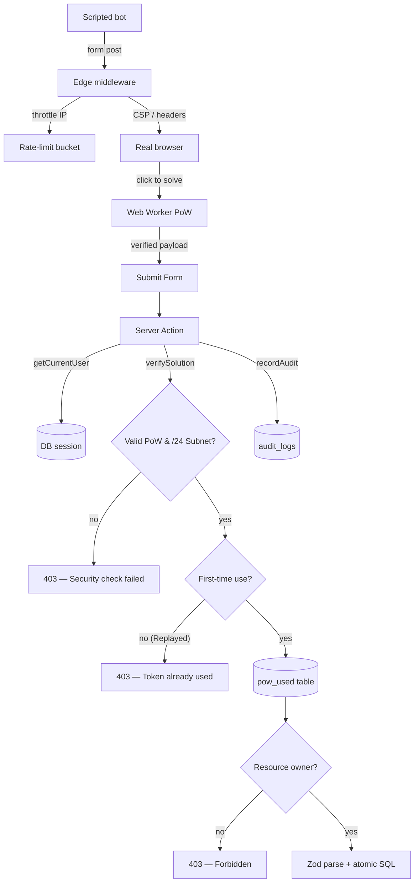
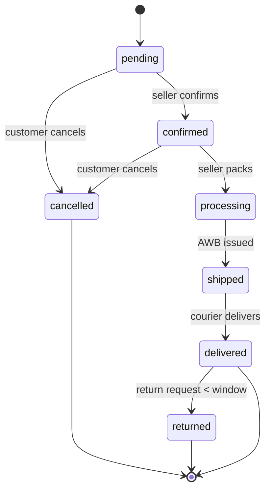
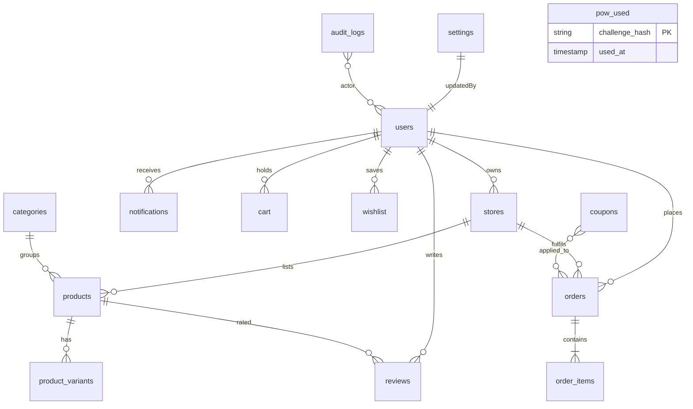

# Architecture

## 🧭 High-level request flow

```mermaid
flowchart LR
  Visitor[Visitor browser] -->|HTTPS| CF[Cloudflare Pages edge]
  CF -->|static or SSR| Next[Next.js 16 app]
  Next -->|drizzle-orm| Neon[(Neon PostgreSQL)]
  Next -->|ImageKit URL| IK[ImageKit CDN]
  Next -->|wsrv.nl proxy| Ws[wsrv.nl]
  Next -->|B2 worker| CFW[Cloudflare Worker]
  CFW -->|signed auth| B2[(Backblaze B2)]
  Next -->|quiet-mail| QM[quiet-mail SMTP]
  Next -.audit.-> Neon
  Admin[Admin] -->|reverse-proxy| CF
```

## 🔐 Security layers (defence in depth)

```mermaid
flowchart TD
  Bot[Scripted bot] -->|form post| Edge[Edge middleware]
  Edge -->|throttle IP| Middleware[Rate-limit bucket]
  Edge -->|CSP / headers| Browser[Real browser]
  Browser -->|click to solve| Solve[Web Worker PoW]
  Solve -->|verified payload| FormSubmit[Submit Form]
  FormSubmit --> Action[Server Action]
  Action -->|getCurrentUser| Session[(DB session)]
  Action -->|verifySolution| PoW{Valid PoW & /24 Subnet?}
  PoW -- no --> Reject[403 — Security check failed]
  PoW -- yes --> AntiReplay{First-time use?}
  AntiReplay -- no (Replayed) --> ReplayReject[403 — Token already used]
  AntiReplay -- yes --> StoreToken[(pow_used table)]
  StoreToken --> Owner{Resource owner?}
  Owner -- no --> Deny[403 — Forbidden]
  Owner -- yes --> Mutual[Zod parse + atomic SQL]
  Action -->|recordAudit| Audit[(audit_logs)]
```

## 🛒 Order lifecycle (state machine)

```mermaid
stateDiagram-v2
  [*] --> pending
  pending --> confirmed: seller confirms
  pending --> cancelled: customer cancels
  confirmed --> processing: seller packs
  confirmed --> cancelled: customer cancels
  processing --> shipped: AWB issued
  shipped --> delivered: courier delivers
  delivered --> returned: return request < window
  cancelled --> [*]
  returned --> [*]
  delivered --> [*]
```

## 🧱 Database (key relationships)

```mermaid
erDiagram
  users ||--o{ stores : owns
  users ||--o{ orders : places
  users ||--o{ reviews : writes
  users ||--o{ notifications : receives
  users ||--o{ cart : holds
  users ||--o{ wishlist : saves
  stores ||--o{ products : lists
  stores ||--o{ orders : fulfils
  categories ||--o{ products : groups
  products ||--o{ product_variants : has
  products ||--o{ reviews : rated
  orders ||--|{ order_items : contains
  coupons }o--o{ orders : applied_to
  settings ||--|| users : updatedBy
  audit_logs }o--o{ users : actor
  pow_used {
    string challenge_hash PK
    timestamp used_at
  }
```
