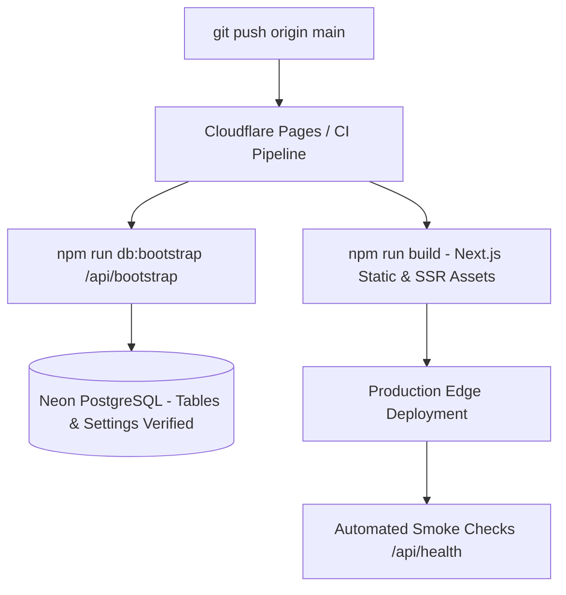
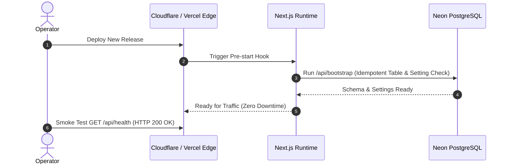

# Operator Runbook & Production Operations Manual

A field guide for operating, deploying, verifying, and recovering Aalm Vastralay in production.



---

## 🟢 Service Health & Incident Response

```mermaid
flowchart LR
  Symptom{Incident Detected}
  Symptom -->|500 Errors| SecurityAudit[/admin/security Logs]
  Symptom -->|DB Disconnect| NeonCheck[Check Neon Console & Connection Pool]
  Symptom -->|Bot Shield Fail| PowAdjust[Lower security.powDifficulty to 2]
  Symptom -->|Lockout| Unlock[Clear login_attempts or wait 15m]
```

| Symptom | First check | Fix |
| --- | --- | --- |
| `/api/health` returns `{ok:false}` | Neon status page (`https://neonstatus.com`) | If Neon is up, check connection-pool exhaustion in `audit_logs`; restart the instance or raise pool limit. |
| 500s on `seller.orders` | `/admin/security` → last 80 entries | If a single actor shows multiple 429s, raise `security.formRateLimit` or unlock the account. |
| Email confirmations not arriving | `audit_logs` → search for `order.place` | `QUIETMAIL_API_*` missing? Messages are safely logged to the server console until keys are set. |
| Bot shield slow / blocking real users | `/admin/settings?group=security` | Lower `security.powDifficulty` from 3 to 2 (≈ 16× faster). |
| Sign-in lockouts | `/admin/security` → "Recent failed sign-ins" | Truncate `login_attempts` or wait `security.lockMinutes`. |
| Catalogue empty after deploy | `scripts/seed-and-backfill.ts` | `npm run db:bootstrap` — idempotent, will create missing tables and backfill settings. |

---

## 🚀 Production Deployment Flow



### Deployment Commands

```bash
# 1. Clean install dependencies
npm ci

# 2. Idempotent database schema & settings bootstrap
npm run db:bootstrap

# 3. Production build
npm run build

# 4. Deploy to edge / container
git push origin main
```

---

## 🛟 Common Operator Tasks

| Task | Location / Action |
| --- | --- |
| Toggle demo accounts | `/admin/settings?group=features` → `Show demo accounts box on sign-in page` |
| Disable a coupon | `/admin` → Coupons row → toggle active switch |
| Suspend an abusive seller | `/admin` → Stores → Click "Suspend" |
| Add a top-level category | `/admin` → Categories → Click "Add category" |
| Process order refund | `/seller/orders` → set status to `cancelled` (refund logged in audit log) |
| Adjust commission window | `/admin/settings?group=seller` → `Commission-free months` |
| Whitelist trusted IP | `/admin/settings?group=security` → keep `Trusted proxy headers` enabled |

---

## 🧪 Smoke Tests After Release

```bash
curl -fsS https://<site>/api/health | grep '"ok":true'
curl -fsS https://<site>/api/security/challenge | grep '"algorithm":'
curl -fsS https://<site>/sitemap.xml | head
curl -fsS https://<site>/robots.txt | head
```

---

## 📈 Capacity & Tier Scaling Triggers

| Metric | Free Tier Cap | Production Scaling Path |
| --- | --- | --- |
| Neon Database Rows | ~200 MB storage | Neon Launch / Scale tier |
| ImageKit CDN Bandwidth | 20 GB / month | ImageKit Starter ($25/mo) |
| Cloudflare Pages Edge | Unlimited requests | Stays free |
| Cloudflare Worker B2 Proxy | 100k requests / day | Cloudflare R2 or Worker Paid ($5/mo) |
| Authentication | Built-in PBKDF2 / Clerk | Scalable up to 50k MAU |
